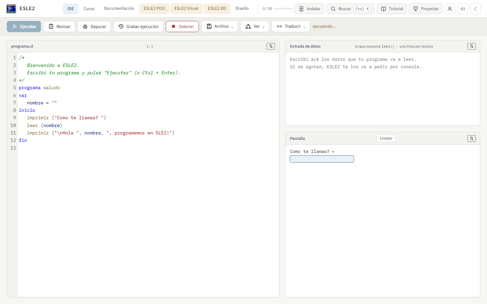
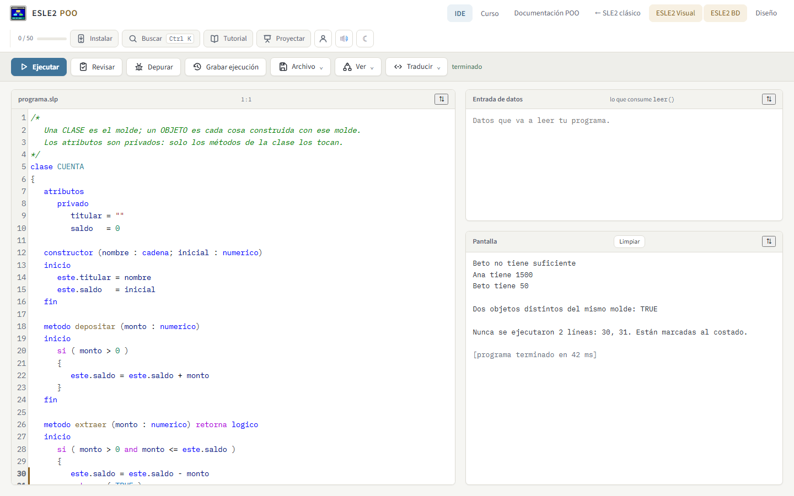
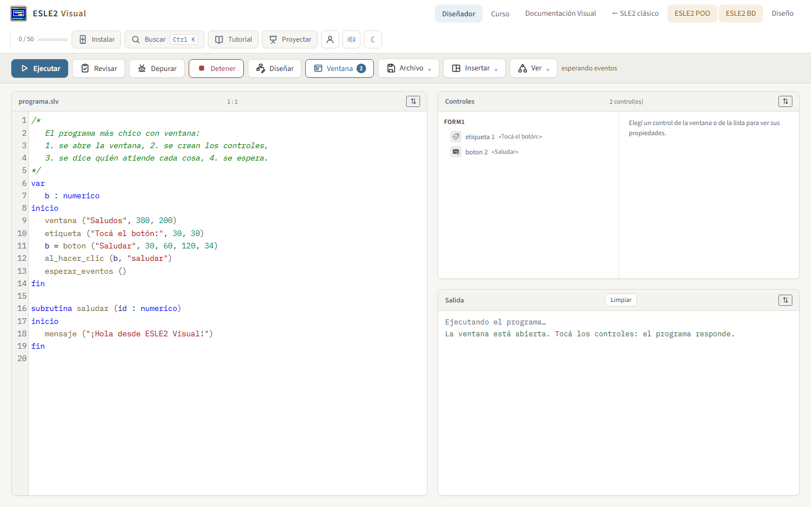
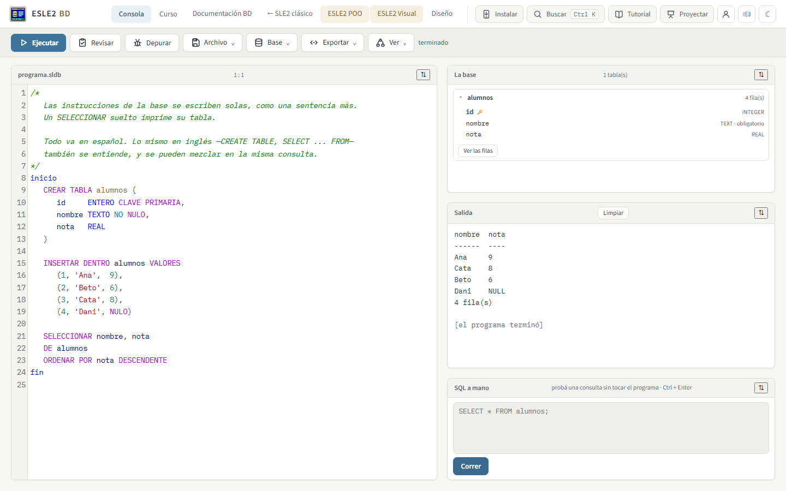
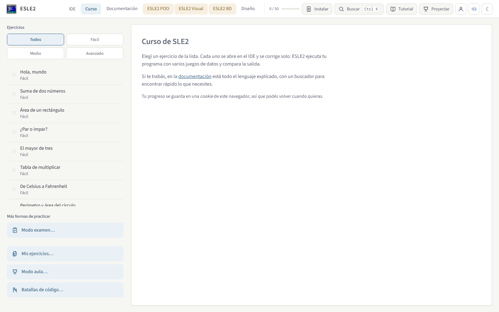

<div align="center">


# ESLE2

### El lenguaje SL/SLE2, entero en el navegador. Sin instalar nada.

[](https://esle2.vercel.app)
[](https://esle2blog.vercel.app)
[](LICENSE)
[](package.json)
[](test)
[](CONTRIBUIR.md)

</div>

<br>

<div align="center">

<sub>El IDE clásico ejecutando un programa que pide el nombre y saluda — sin compilar nada del lado del servidor: todo corre en esta pestaña.</sub>
</div>

<br>

<table align="center"><tr>
<td width="25%"><div align="center"><sub><b>ESLE2 POO</b> — clases y objetos</sub></div></td>
<td width="25%"><div align="center"><sub><b>ESLE2 Visual</b> — ventanas y controles</sub></div></td>
<td width="25%"><div align="center"><sub><b>ESLE2 BD</b> — SQL en español</sub></div></td>
<td width="25%"><div align="center"><sub><b>Curso</b> — 50+50+50 ejercicios</sub></div></td>
</tr></table>

Entorno de desarrollo (IDE) para el lenguaje **SL / SLE2** que funciona íntegramente en el
navegador, sin instalar nada, más **tres cursos integrados** de 50 ejercicios cada uno con
corrección automática —el clásico, el de objetos y el de ventanas— y una **documentación completa
con buscador**.

<br>

| | |
| --- | --- |
| 🧠 **Se corrige solo** | Cada ejercicio corre con varios juegos de datos y compara la salida — sin entregar nada a nadie. |
| 🔌 **Cero instalación, cero internet** | Es una página web; instalada como app sigue andando sin conexión. |
| 🔁 **Se traduce a seis lenguajes** | JavaScript, Python, Java, C, C++ y C#, generados y verificados contra el intérprete real. |
| 🐞 **Depurador, diagrama y memoria** | Paso a paso, diagrama de flujo automático y un simulador de memoria con direcciones y montículo. |
| 🗂️ **Versiones, sin cuenta ni servidor** | Historial automático + un control de versiones al estilo GitHub Desktop, en un archivo. |
| 🧑‍🏫 **Pensado también para el aula** | Modo examen, modo aula, batallas de código y programar en grupo en vivo. |
| ♿ **Accesible de verdad** | Se maneja entero con teclado, sin trampas de foco, con nombres accesibles en cada diálogo. |
| 🔒 **Seguro contra HTML ajeno** | Todo enunciado, guía o entrega de otra persona se sanea antes de llegar a la pantalla — CSP estricta de fondo. |
| 🇵🇾 **Todo en español** | Palabras clave, errores y documentación, pensados para cómo se enseña acá. |

<details>
<summary><b>🗺️ Índice — expandir para ver las más de 60 secciones de este documento</b></summary>

**Empezar**
[Los primeros cinco minutos](#los-primeros-cinco-minutos) ·
[Tutorial con capturas](#tutorial-toda-la-interfaz-con-capturas) ·
[Uso](#uso) ·
[El lenguaje implementado](#el-lenguaje-implementado)

**Los cuatro entornos**
[ESLE2 POO](#esle2-poo-el-mismo-lenguaje-con-objetos) ·
[ESLE2 Visual](#esle2-visual-ventanas-controles-y-dibujo) ·
[ESLE2 BD](#esle2-bd-bases-de-datos-y-sql) ·
[Diseño (temas y colores)](#diseño-colores-elegidos-por-el-usuario) ·
[SLE2 en VS Code](#sle2-en-visual-studio-code)

**Herramientas para aprender**
[Modo flexible](#modo-flexible-compilar-con-errores) ·
[Prueba de escritorio](#prueba-de-escritorio-en-una-tabla) ·
[Simulador de memoria](#simulador-de-memoria) ·
[Diagrama de flujo](#diagrama-de-flujo) ·
[Editor de diagramas](#editor-de-diagramas) ·
[Autocompletado](#autocompletado) ·
[Resaltado de sintaxis](#resaltado-de-sintaxis) ·
[Traducción a JS y Python](#traducción-a-javascript-y-a-python) ·
[POO a Python y Java](#esle2-poo-traducido-a-python-y-a-java) ·
[Depurador paso a paso](#depurador-paso-a-paso) ·
[Viajar en el tiempo](#viajar-en-el-tiempo) ·
[Historial de versiones](#historial-de-versiones) ·
[Versiones del proyecto](#versiones-del-proyecto) ·
[Racha de días](#racha-de-días) ·
[Micro-sonidos](#micro-sonidos) ·
[Buscador global](#buscador-global-ctrl--k) ·
[Progreso portable](#progreso-portable) ·
[Otra forma de resolverlo](#otra-forma-de-resolverlo) ·
[Repaso espaciado](#repaso-espaciado) ·
[Estadísticas del curso](#cómo-venís-estadísticas-del-curso)

**Aula y colaboración**
[Modo examen](#modo-examen) ·
[Modo presentación](#modo-presentación) ·
[Modo enfoque](#modo-enfoque) ·
[Batallas de código](#batallas-de-código) ·
[Modo aula](#modo-aula-una-guía-repartida-por-enlace) ·
[Mis ejercicios](#mis-ejercicios-dar-clase-con-esle2) ·
[Programar en grupo](#programar-en-grupo) ·
[Transmitir mi lógica](#transmitir-mi-lógica)

**Plataforma**
[Explorador de archivos](#explorador-de-archivos-apagado-por-defecto) ·
[Paneles](#paneles-que-se-mueven-y-se-estiran) ·
[Barra de herramientas e iconos](#la-barra-de-herramientas-y-los-iconos) ·
[En el celular](#en-el-celular) ·
[Instalar como aplicación](#instalar-como-aplicación) ·
[Funciona sin internet](#funciona-sin-internet) ·
[Quién está usando esta máquina](#quién-está-usando-esta-máquina)

**Calidad**
[Seguridad](#seguridad-qué-se-puede-y-qué-no) ·
[Accesibilidad](#accesibilidad) ·
[Sugerencias de estilo](#sugerencias-de-estilo) ·
[Detección de errores](#detección-de-errores)

**Para contribuir**
[Cómo meterle mano](#cómo-meterle-mano) ·
[Publicar una versión](#publicar-una-versión) ·
[Archivos del repositorio](#archivos) ·
[Nota sobre el logo](#nota-sobre-el-logo) ·
[Nota sobre el manual](#nota-sobre-el-manual)

</details>

<br>

---

El intérprete es una reimplementación en JavaScript del lenguaje descrito en:

- *«Introducción al lenguaje SL»*, Juan Segovia Silvero — CNC, Universidad Nacional de
  Asunción, 1999 (`documentos sle2/libro-sl.md`).
- *«Índice de subrutinas y funciones predefinidas de SL»*, J. Segovia Silvero, 2004
  (`documentos sle2/sle2-instrucciones.md`).

Ambos PDF están convertidos a Markdown en la carpeta `documentos sle2/`.

## Los primeros cinco minutos

Alguien entra por primera vez y se encuentra un IDE completo: dos pestañas, veinte botones, un
editor, una pantalla, una entrada de datos y un lienzo. Nosotros sabemos que todo eso es bueno; él ve
una cabina de avión.

La primera vez —y **solo** la primera— aparecen cuatro carteles: el programa que ya está escrito, el
botón de ejecutar, dónde sale el resultado, y que existe un curso. Nada más; el resto se descubre
solo, que es como se descubre todo acá.

Tres reglas que se cumplen a rajatabla:

* **no es modal y no hay telón negro.** El cartel señala con un borde y se corre a un costado: la
  persona tiene que poder mirar —y tocar— lo que le estamos mostrando. Un recorrido que secuestra la
  pantalla enseña a saltearse los recorridos;
* **no le aparece a quien no está empezando.** Se muestra solo si nunca lo vio *y* no hay nada
  escrito. Quien abrió un programa compartido, o venía usando ESLE2, no ve nada: un cartel de
  bienvenida a alguien que ya sabe usar el programa es peor que no tenerlo;
* **se sale en un clic** —*Ya sé usarlo*, o `Escape`— y no vuelve nunca. Se recorre entero con el
  teclado, y al terminar el foco vuelve al editor y no al principio de la página.

El último paso del recorrido es el que importa: se toca *Ejecutar*, el programa pregunta el nombre en
la pantalla, se lo escribe y saluda. En cinco minutos alguien que nunca programó vio un programa
correr y contestarle. `test/test-bienvenida.js` prueba sobre todo lo contrario —a quién **no** tiene
que aparecerle—, y la verificación en el navegador hace esa vuelta completa hasta el saludo.

## Tutorial: toda la interfaz, con capturas

Los cuatro carteles de arriba son para arrancar, aparecen una sola vez y no explican la mitad de lo
que hay. Lo otro que hacía falta era una **referencia de la interfaz**: qué es cada panel, qué hace
cada botón y cuándo conviene usarlo. Eso es el botón **Tutorial** de la barra de arriba, en los
cuatro IDE.

Se abre un cuadro con el índice a la izquierda y una parte de la pantalla por vez a la derecha: la
**captura** de esa parte y, debajo, una línea por control con qué hace, cuándo usarlo y qué necesita.
Lo que borra algo lo dice ahí mismo. Cada entorno muestra el suyo: en Visual está *Diseñar* y
*Ventana*, en BD están *Base* y *Exportar*, y ninguno de los dos explica *Grabar ejecución*, que en
esas barras no existe.

Es un cuadro y no un recorrido sobre la pantalla de verdad a propósito: el recorrido obliga a ir en
orden, tapa justo lo que hay que mirar y no se puede consultar mientras se trabaja. Abrirlo no
cambia nada —ni el programa, ni la base, ni los paneles—, se cierra con `Escape` y el foco vuelve al
botón. Mientras está abierto, los atajos de atrás quedan frenados: `Escape` cierra el cuadro y no
corta el programa que esté corriendo, y `F9` no arranca una ejecución que nadie ve. Eso se arregló
en `js/menus.js` para **todos** los diálogos, que tenían el mismo problema.

Las 53 capturas no están hechas a mano: las saca `tools/capturar-tutorial.js` con Playwright contra
el sitio levantado en un servidor propio, preparando cada estado —cargar un ejemplo, ejecutar, abrir
el menú, abrir el diálogo— y recortando la región. Volver a sacarlas todas es un comando, y
`--verificar` avisa si alguna región ya no existe sin tocar las imágenes. Pesan 1,6 MiB en total y
están en `sw.js`, así que el tutorial también anda sin internet.

`test/test-tutorial.js` ata el texto a la realidad: que ningún entorno explique un botón que esa
página no tiene (compara contra el HTML), que ninguna captura falte ni sobre, que todas tengan sus
medidas y que el total entre en el presupuesto.

## Seguridad: qué se puede y qué no

ESLE2 no tiene servidor, ni cuentas, ni base de datos de nadie: todo pasa en el navegador del
alumno. Eso saca de la mesa la mitad de los problemas de siempre —no hay contraseñas que robar, ni
una base que volcar, ni una sesión que secuestrar— y deja uno bien concreto: **el sitio recibe
contenido de otros**. Un programa que viaja en un enlace, una guía de clase repartida por WhatsApp,
una entrega `.json`, un `.sql` que alguien pasó, lo que escribe el compañero en «Programar de a
dos». Si ese contenido llega a ejecutarse, corre con los permisos del sitio: puede leer y borrar lo
que ESLE2 guardó en ese navegador —los programas, el avance—, cambiar lo que se ve en pantalla o
pedir un permiso haciéndose pasar por ESLE2.

Eso es lo que hay que cerrar, y es lo que se cerró. Dicho con la misma honestidad: esto **no** es
lo mismo que «entrar a la computadora del alumno». Salir del navegador hacia el sistema operativo
necesita un agujero del navegador, no de este sitio. Y nada de lo que pase en una máquina cambia lo
que ven los demás: para eso habría que entrar al repositorio o a la cuenta de Vercel, que se
protegen aparte y con otras herramientas.

### El agujero que había

Estaba abierto, y era el peor de los posibles en un sitio así: el **enunciado de un ejercicio se
pegaba en la página tal cual venía**. Los del curso son nuestros, pero los de una guía de clase y
los de «Mis ejercicios» llegan de afuera, y terminaban en la misma pantalla. Un enlace de guía
preparado ejecutaba JavaScript apenas el alumno tocaba el ejercicio.

Está medido, no supuesto: el mismo ataque corrido contra la versión publicada anterior ejecutaba
cinco veces; contra esta, cero. Con él venían otros cinco de la misma familia: el nivel de un
ejercicio pegado adentro de un `class="…"`, el id adentro de un `data-…`, el título de un examen
adentro de un `title="…"` con un escapador que no escapaba comillas, los contadores de una entrega
`.json` pegados como HTML, y un nombre de perfil con comillas.

### Un solo lugar decide qué es texto

`js/seguro.js`. Es el único módulo que puede convertir un texto ajeno en HTML, y lo hace al revés
de como se suele intentar: **no limpia lo que vino, reconstruye**. Lo que sale son etiquetas que
escribe esa función —`code`, `strong`, `em`, `b`, `i`, `br`, `p`, `ul`, `ol`, `li`, `pre`, sin un
solo atributo— más texto escapado. Por eso no hay que acertarle a la lista de los mil disfraces de
`<script>`: lo que no está permitido es texto, y se ve como texto.

Ahí mismo están los límites de todo lo que entra —cuánto puede pesar un enlace, una guía, un
enunciado, un archivo— y la limpieza de un ejercicio ajeno, que se rearma campo por campo: el nivel
sale de una lista cerrada, el id tiene que ser un id (`__proto__` no lo es), los casos son texto y
están acotados, y lo que venga de más no se copia.

`test/test-seguro.js` le tira los treinta ataques clásicos y comprueba una sola cosa: que sacando
las etiquetas permitidas no quede ni un `<` en lo que salió.

### Cabeceras: la segunda puerta

Si algún día se cuela otro sink, la CSP lo frena igual. `vercel.json` sirve todo el sitio con:

```
default-src 'self'; base-uri 'self'; object-src 'none'; frame-ancestors 'none'; frame-src 'none';
form-action 'none'; script-src 'self'; script-src-attr 'none';
style-src 'self' https://fonts.googleapis.com; style-src-attr 'unsafe-inline';
font-src 'self' https://fonts.gstatic.com; img-src 'self'; media-src 'self';
connect-src 'self' wss:; worker-src 'self'; manifest-src 'self'
```

`script-src 'self'` sin `unsafe-inline` quiere decir que un `<script>` que aparezca en la página —o
un `onclick=` en un atributo— no corre. Para poder tenerla hubo que sacar el único script escrito
adentro de un HTML (el de `vivo.html`, ahora `js/vivo-pagina.js`), los cuatro `<style>` de la
documentación de POO y los tres `style="…"` que quedaban. `frame-ancestors 'none'` más
`X-Frame-Options: DENY` impiden meter ESLE2 en un iframe ajeno, que es como se arma una pantalla
falsa. Van también `nosniff`, `Referrer-Policy: no-referrer`, HSTS de dos años, COOP/CORP y un
`Permissions-Policy` que apaga cámara, micrófono, ubicación y el resto.

La excepción, dicha: `style-src-attr 'unsafe-inline'` sigue permitida porque el vendor de
«Programar en grupo» pinta los cursores de los demás con un atributo `style`. Es la única, y no afecta
a los scripts.

`test/test-cabeceras.js` prueba las dos mitades sin navegador: que la política siga siendo estricta
y que ningún HTML vuelva a tener un `<script>`, un `<style>` o un `onclick=` adentro —que es lo que
obligaría a aflojarla—. En el navegador se recorren las diez páginas con las cabeceras de verdad
puestas, escuchando `securitypolicyviolation`, y se comprueba que el sitio no entre en un iframe.

### Lo demás

- **Cookies**: `SameSite=Lax` ya estaban; ahora llevan `Secure` cuando la página va por https, y no
  en `localhost`, donde el navegador las tiraría.
- **Archivos**: todo `.sl`, `.sql`, `.json` de entrega o de progreso se mira el tamaño **antes** de
  leerlo. Un archivo de 800 MB no es un ataque muy elaborado, pero cuelga la pestaña igual.
- **Guías comprimidas**: el gzip se corta mientras se descomprime, con tope. Un enlace de 40 KB
  puede descomprimirse en cientos de megas si alguien lo arma para eso.
- **Planillas**: en el `.csv` del profesor, una celda que empiece con `=`, `+`, `-` o `@` sale de
  la columna de fórmulas. Un alumno que se anota «=1+1» hacía calcular la planilla ajena.
- **Service worker**: ahora solo guarda respuestas del propio origen, con estado 200, sin
  redirección y con un tipo que corresponda a la extensión. Sin eso, el portal de wifi de un
  colegio podía quedar guardado como si fuera nuestro código. Y borra solo las cachés de ESLE2.
- **Lo que no se toca**: el modo usuario es una cerradura y no un cifrado, y el propio diálogo lo
  dice antes de que nadie elija una contraseña; la transmisión en vivo es pública por diseño y su
  «clave» no es un secreto; y `readOnly` en el visor no autentica a nadie.

## Modo flexible: compilar con errores

El compilador es estricto a propósito: al primer error para y lo cuenta bien. Eso está perfecto
para entregar, pero es penoso para aprender —quien empieza suele tener cinco errores a la vez y los
descubre de a uno, recompilando cinco veces—.

**Ver → Modo flexible** (en los cuatro IDE) compila igual pero anota **todos** los errores, subraya
cada línea en el editor y deja correr el programa hasta el primero. El estricto sigue estando y es
el que manda cuando hay que entregar.

Recupera en dos alturas, y ninguna inventa código:

- **falta un símbolo**: se anota y se sigue como si hubiera estado. Y si el símbolo que falta
  aparece más adelante en la misma línea, no falta: sobra lo que hay en el medio. Es el caso de
  `si (a = 1)`, donde el `)` está y el estorbo es el `=`; saltar hasta él evita que el parser
  quede corrido y se queje cuatro veces del mismo renglón;
- **la sentencia no se entiende**: se anota, queda un **agujero declarado** —no una sentencia
  adivinada— y se sigue en la línea siguiente. El corte es por línea y no por una lista de palabras
  porque en SL casi todo empieza con un identificador: `imprimir` y `leer` no son palabras
  reservadas, así que ninguna lista serviría.

Ejecutar un agujero lanza el error **en su línea**, así que el programa corre hasta ahí y se ve la
salida que llevaba, que es lo que sirve para ubicarlo. Y el flexible culpa a la línea donde hay que
escribir el símbolo, no a la línea donde el parser se dio cuenta: para `si (a == 1` sin cerrar, el
estricto dice «línea 3» y el flexible «línea 2».

Anda con los cuatro dialectos porque no reescribe la gramática de nadie: se cuelga de `exige()` y
de `sentencias()`, que son de la clase base.

## Prueba de escritorio, en una tabla

**Ver → Prueba de escritorio**: el programa seguido paso a paso como se hace en el pizarrón. Una
fila por sentencia ejecutada, una columna por variable, y en cada celda el valor **solo cuando
cambia** —una tabla con todos los valores repetidos en todas las filas es ilegible, y lo que se
quiere ver es justamente dónde cambia cada cosa—. Se lleva en tres formatos porque los trabajos se
entregan de tres maneras: monoespaciado, Markdown y `.csv`.

La grabación la hace el simulador de memoria, que ya corría el programa parándose antes de cada
sentencia. Dos cosas hubo que agregarle:

- **qué imprimió cada paso**, no solo el total: una columna «salida» que dijera siempre lo mismo no
  enseñaría nada;
- **una foto al salir de cada subrutina**. El grabador se detiene *antes* de cada sentencia, así que
  el valor que deja la última línea de una subrutina no tenía ninguna foto siguiente donde aparecer:
  el resultado de la subrutina no se veía nunca.

Las locales llevan el nombre de la subrutina adelante (`sumar.i`), porque dos subrutinas pueden
tener una `i` cada una y mezclarlas en la misma columna sería mentira.

## Exportar a seis lenguajes

Al JavaScript y el Python de siempre se suman **C, C++, Java y C#**. Los cuatro salen de un solo
traductor, `js/traducir-c.js`: comparten todo lo que tiene chance de estar mal —el orden de un
`desde`, cómo se cierra un `repetir`, qué operador reemplaza a cada uno, cómo viaja un parámetro
por referencia— y se diferencian en vocabulario. Cuatro archivos separados serían cuatro copias de
la misma lógica y cuatro lugares donde arreglar cada error.

**El Java y el C# generados se compilan y se corren de verdad en las pruebas**, y su salida se
compara carácter por carácter con la del intérprete de SLE2. Así aparecieron tres errores que una
revisión a ojo no habría encontrado:

- los números se imprimían con otra cantidad de decimales (SL usa 12 cifras significativas, y
  `str()` dos decimales);
- el parámetro por referencia **no volvía**: la cajita de Java se escribía y nadie copiaba el valor
  de vuelta. Ahora la llamada queda en un bloque que lo devuelve, y en C# se usa `ref`, que existe
  y hace exactamente eso;
- `log()` de SL es **decimal**, no natural: traducirlo como el `log()` de C habría cambiado el
  resultado sin que nadie se entere.

## Editor de diagramas

**Ver → Editor de diagramas**: armar el diagrama con bloques y que salga el programa. El dibujo de
la derecha **no es un dibujo aparte**: es el diagrama del programa generado, hecho con el mismo
`js/diagrama.js` del resto del sitio, así que lo que se ve y lo que se ejecuta no pueden
separarse.

El modelo es un árbol de bloques y no una tela con flechas sueltas, porque un diagrama con flechas
libres puede quedar imposible de convertir en un programa —un salto al medio de un ciclo— y esto es
para aprender a estructurar. Adentro de cada bloque se escribe SLE2 tal cual: es una materia de
programación, la condición se escribe.

Se puede **traer un programa que ya existe** y seguir editando su diagrama. La prueba que sostiene
todo es el ida y vuelta: programa → diagrama → programa tiene que compilar, hacer exactamente lo
mismo, y una segunda vuelta dar el mismo texto.

## ESLE2 BD: bases de datos y SQL

Una página aparte —[`bd.html`](bd.html)— con el mismo SL de siempre y una base de datos adentro.
Las instrucciones de la base **se escriben solas**, en español o en inglés, como una sentencia más:

```
inicio
   CREAR TABLA alumnos (id INTEGER PRIMARY KEY, nombre TEXT, nota REAL)
   INSERTAR DENTRO alumnos VALORES (1, 'Ana', 9), (2, 'Beto', 6)
   SELECCIONAR nombre, nota DE alumnos ORDER BY nota DESC
fin
```

Un `SELECCIONAR` suelto imprime su tabla y además deja el resultado listo para recorrer con
`filas()` y `dato()`. Adentro de una instrucción, `@variable` es el valor de esa variable de SL,
citado como corresponde: nadie tiene que armar la consulta a mano con `+` y `str()`.

Nada de esto toca la gramática de SL. Es una **traducción de texto a texto** previa a compilar
(`SLE2BD.aSQL`): cada instrucción suelta se reescribe como una llamada, conservando los renglones
—el SQL queda adentro de una cadena de varias líneas—, así que los errores, el diagrama, la prueba
de escritorio y el simulador de memoria siguen señalando la línea real del editor. Empieza en la
primera palabra de un renglón cuando esa palabra es un verbo de SQL, y termina en el `;` o donde el
renglón siguiente ya no puede continuarla. Para lo que se arma en el programa quedan las
subrutinas (`sql`, `consultar`, `filas`, `afectadas`, `columna`, `dato`, `hay_dato`, `mostrar`,
`tablas`, `nombre_tabla`). En una materia de bases de datos lo que hay que aprender es SQL, no otra
sintaxis.

**El motor de SQL está escrito a mano** (`js/sql.js`), como el intérprete de SL. La alternativa
era traer SQLite compilado a WebAssembly: más de un mega de binario en la caché de la aplicación y
dentro del cual no se puede ver nada. Así entra en un archivo que se lee, corre sin conexión y se
prueba en Node.

Entiende `CREATE TABLE` (con `PRIMARY KEY`, `NOT NULL`, `UNIQUE` y `DEFAULT`, y las hace
cumplir), `DROP`, `INSERT`, `UPDATE`, `DELETE` y `SELECT` con `DISTINCT`, `JOIN`,
`LEFT JOIN`, `WHERE`, `GROUP BY`, `HAVING`, `ORDER BY`, `LIMIT`/`OFFSET`,
`BETWEEN`, `IN`, `LIKE` y las funciones de agregación y de texto.

**Las relaciones son de verdad.** `REFERENCES` (o `FOREIGN KEY (col) REFERENCES otra (col)`) se
controla al crear la tabla —que exista y que apunte a una columna que no se repita— y al insertar y
modificar: un valor que no está del otro lado se rechaza, y `NULL` se admite porque quiere decir
«todavía no se sabe cuál». Al borrar no se controla nada, y está dicho: para eso harían falta
`ON DELETE CASCADE` y `RESTRICT`, y elegir uno de los dos por nuestra cuenta sería inventar lo que
el programa no dijo.

**El diagrama entidad-relación sale solo** (`Base → Diagrama de la base`): una caja por tabla, la
llave en la clave primaria, una línea por cada clave foránea, y las tablas acomodadas por capas —el
mismo orden en que hay que crearlas—. Se baja como `.svg` y se copia como texto para el informe.

**Y también al revés** (`Base → Dibujar el diagrama…`): se arma el diagrama y el código aparece
abajo mientras se dibuja. Una relación se hace eligiendo *a qué columna apunta*, y la lista solo
ofrece columnas que pueden recibir una flecha, así que **no se puede dibujar un diagrama que
después no compile**. La vuelta completa —base → diagrama → código → base— está probada: tiene que
dar la misma estructura, y una segunda vuelta, el mismo código.

**NULL se comporta como en SQL de verdad**, que es lo que más cuesta y lo que más fácil se
implementa mal: `NULL = NULL` no da verdadero, cualquier cuenta con NULL da NULL, los agregados lo
ignoran y `FALSE AND NULL` es FALSE mientras que `TRUE AND NULL` es NULL. Como en SL no existe
el nulo, `dato()` devolvería la cadena vacía y se confundiría con un texto vacío de verdad: para
eso está `hay_dato()`.

Una cadena puede ocupar **varias líneas** —la otra diferencia con el SL clásico— porque adentro
va una consulta y partirla con `+` la volvería ilegible justo donde lo importante es leer el SQL.

**Exportar** baja un `.sql` para **SQLite, MySQL o PostgreSQL**, y las diferencias entre los tres
se ven: cómo se protege un nombre (`"así"` o `\`así\``), cómo se traduce un `DECIMAL(10,2)`,
que un `TEXT` no puede ser clave primaria en MySQL sin largo, y que solo MySQL interpreta la barra
invertida adentro de un texto. Sale texto y no un `.sqlite` binario a propósito: un archivo de
texto se lee, se corrige y se entrega.

## Cómo meterle mano

Este archivo cuenta **qué hace** ESLE2. [`CONTRIBUIR.md`](CONTRIBUIR.md) cuenta **cómo se le agregan
cosas**: las cuatro reglas que no se negocian —sin servidor, sin IA, sin tocar el lenguaje, y que
todo ande sin internet y sin mouse—, el ciclo de trabajo, cómo se agrega un ejercicio o una función
del lenguaje, y la lista de los errores que ya cometimos para no volver a descubrirlos.

Está escrito para el día en que esto lo mantenga alguien que no lo escribió.

## Uso

En línea: **<https://esle2.vercel.app>** (se publica con `vercel deploy --prod`; `.vercelignore`
deja fuera `test/` y los manuales).

En local, abrí `index.html` en el navegador (doble clic alcanza). Para servirlo: `npx serve .`

- **IDE** (`index.html`): escribí el programa, cargá los datos en *Entrada de datos* y pulsá
  **Ejecutar** (`Ctrl + Enter`). **Revisar** verifica la sintaxis y da recomendaciones;
  **Depurar** (F9) corre el programa paso a paso, marcando la línea y mostrando las variables;
  **Detener** corta un ciclo infinito; **Compartir** copia un enlace que lleva adentro el programa
  y los datos (viajan en la propia dirección, no se suben a ningún lado);
  **Archivos…** muestra los archivos en memoria que usan
  `set_stdin()` y `set_stdout()`, y permite **subir** un `.txt` de tu computadora o **bajar** el
  que escribió el programa; **Argumentos** alimenta a `paramval()` y `pcount()`.
- **Curso**: 50 ejercicios (16 fácil, 18 medio, 16 avanzado), varios de ellos dedicados a las
  novedades del manual de 2004. Hay otros 50 de objetos en `poo.html` y otros 50 de ventanas y
  dibujo en `visual.html`.
- **Documentación** (`documentacion.html`): 21 secciones con nueve diagramas, índice lateral y buscador
  (atajo `/`) que filtra los apartados y resalta las coincidencias.
- **Tema**: claro por defecto, con botón para modo oscuro (☾ / ☀).

El progreso de los tres cursos (`esle2_progreso`, `esle2_progreso_poo` y `esle2_progreso_vis`) y
el tema (`esle2_tema`) se guardan en cookies, y **Exportar progreso** los baja juntos en un
archivo.

## El lenguaje implementado

**Base (libro de 1999)**: `programa`, `const`, `tipos`, `var`, subrutinas y funciones con
parámetros por valor y por `ref`, recursión, `numerico` / `cadena` / `logico`, vectores y
matrices fijos y abiertos (`dim`, `alen`, literales estructurados, contornos irregulares),
registros y alias de tipos, `si` / `sino si`, `mientras`, `repetir…hasta`, `desde…paso`,
`eval` / `caso`, y todos los operadores con su precedencia.

**Novedades del manual de 2004**, todas incorporadas:

| Novedad | Qué aporta |
| --- | --- |
| `sub` | Sinónimo de `subrutina`. |
| `&&` `\|\|` `!` `!=` | Sinónimos de `and`, `or`, `not` y `<>`. |
| `var n = 0` | Declaración con valor inicial y tipo inferido; también `v : vector [*] cadena = {…}`. |
| `leer (A)` / `imprimir (A)` | Arreglos y registros enteros en una sola llamada. |
| `set_ofs()` / `get_ofs()` | Separador de salida y marca de arreglo sin dimensionar (`<nodim>`). |
| `set_stdin()` / `set_stdout()` / `eof()` | Archivos de texto (en memoria del navegador, panel **Archivos…**). |
| `set_color()` / `get_color()` | 16 colores de texto y fondo en la pantalla de salida. |
| `set_curpos()` / `get_curpos()` / `get_scrsize()` | Cursor y tamaño de pantalla (25 × 80). |
| `beep()` / `readkey()` | Sonido con pausa y lectura de teclas. |
| `ifval()` | Expresión condicional: solo evalúa la rama que corresponde. |
| `intercambiar()` / `swap()` | Intercambio de dos variables de cualquier tipo. |
| `max()` / `min()` | Mayor y menor de dos valores simples. |
| `terminar()` | Termina el programa anticipadamente. |
| `paramval()` / `pcount()` | Argumentos del programa (campo *Argumentos*). |
| `sec()` | Segundos desde el 1/1/1970 (antes: desde medianoche). |

Fuera de alcance: `runcmd()` (devuelve 127, no hay procesador de comandos).

## ESLE2 POO: el mismo lenguaje con objetos

`poo.html` es un sitio aparte, enlazado desde la barra superior, con **ESLE2 POO**: una extensión
del lenguaje que agrega programación orientada a objetos. No es un lenguaje nuevo — se construye
encima del intérprete de SLE2 (`js/sle2poo.js` extiende el parser y el intérprete de `js/sle2.js`),
así que **todo programa SLE2 válido sigue funcionando ahí sin cambios**.

Lo que agrega:

| Novedad | Sintaxis |
| --- | --- |
| Clases y objetos | `clase CUENTA { … }` · `c = nuevo CUENTA ("Ana", 1000)` |
| Atributos y métodos | `atributos` / `metodo nombre (…) retorna tipo` / `este.saldo` |
| Constructor | `constructor (…) inicio … fin` |
| Encapsulamiento | `privado` (atributos por defecto), `protegido`, `publico` (métodos por defecto) |
| Herencia | `clase GERENTE hereda de EMPLEADO` · `padre.metodo(…)` · `padre.constructor(…)` |
| Abstracción | `clase abstracta FIGURA` · `metodo abstracto area () retorna numerico` |
| Polimorfismo | Despacho dinámico: se ejecuta el método de la clase real del objeto |
| Referencias | Los objetos se asignan por referencia (los registros siguen copiándose), con `nulo` |
| Consultas de tipo | `f es CIRCULO` · `clase_de (o)` · `es_nulo (o)` · `id_de (o)` |
| Atributos de clase | `compartido publico cantidad = 0`, se accede con `CLASE.cantidad` |
| Representación textual | Un método `texto () retorna cadena` hace que `imprimir (obj)` lo use |

Deliberadamente **no** tiene: herencia múltiple, interfaces separadas, sobrecarga, destructores ni
genéricos. La idea es que se entiendan los cuatro pilares sin que el lenguaje estorbe.

`poo-documentacion.html` es su documentación: 17 secciones que explican la POO desde cero, con
buscador propio, seis ilustraciones conceptuales y cuatro diagramas técnicos (anatomía de una clase,
ciclo de vida, despacho dinámico y referencias frente a copias). Los nueve programas de ejemplo de
esa página se ejecutan como parte de las pruebas.

## Diseño: colores elegidos por el usuario

`diseno.html` deja elegir cómo se ve todo el sitio. Los cambios se aplican al instante, se guardan
en la cookie `esle2_diseno` y valen para el IDE, el curso, la documentación y ESLE2 POO.

- **Color de fondo**: ocho fondos, cuatro claros (Papel, Blanco, Sepia, Niebla) y cuatro oscuros
  (Pizarra, Carbón, Azul noche, Alto contraste).
- **Colores de la sintaxis**: diez paletas listas (Daltónico claro y oscuro, VS Code Light+ y Dark+,
  Monokai, Solarized claro y oscuro, ESLE2 clásico, Turbo —el azul del SLE original— y Alto
  contraste), más un selector de color por cada una de las **16 categorías** del resaltado.
- **Fondo del editor**: el que traiga la paleta, uno propio, o el del fondo general.
- **Vista previa en vivo** con un programa clásico y uno con objetos.

Hay una configuración independiente para el modo claro y otra para el oscuro: el botón ☾ / ☀
cambia entre las dos.

## Resaltado de sintaxis

`js/modo-sle2.js` no es una lista de expresiones regulares sino un pequeño analizador con estado
que mira el contexto, como hace Visual Studio Code. Distingue **16 categorías**: comentarios,
textos, números, palabras de control, palabras de declaración, tipos de dato, clases y tipos
propios, funciones y métodos, predefinidas, variables, atributos, parámetros, constantes,
`este`/`padre`, operadores y signos.

Lo que resuelve por contexto y no por la palabra suelta:

| Caso | Cómo se pinta |
| --- | --- |
| `FECHA` en `tipos FECHA : registro` y en `f : FECHA` | tipo, en los dos lugares |
| `nombre` en `este.nombre` | atributo (después de un punto) |
| `calcular` en `calcular (10)` | función; `imprimir (…)` como predefinida |
| `monto` en `(monto : numerico)` | parámetro, distinto de una variable |
| `MAX_NOTAS` en `vector [MAX_NOTAS] numerico` | variable, no tipo (los corchetes llevan un tamaño) |
| campos de un `registro { … }` | variables, no nombres de tipo |

## Traducción a JavaScript y a Python

Los botones **A JavaScript** y **A Python** del IDE clásico escriben el mismo programa en el otro
lenguaje, para ver en JavaScript o en Python lo que ya se sabe hacer en SLE2. El archivo sale listo
para `node programa.js` o `python programa.py`: lleva arriba la entrada de datos como un arreglo y
una copia de las subrutinas de SLE2 que el programa haya usado (solo esas).

Dos decisiones que se ven en el resultado:

- **los vectores siguen empezando en 1** (la casilla 0 queda sin usar), así `A[k]` significa lo
  mismo en los dos lenguajes y el algoritmo se lee igual;
- `imprimir()` acumula en un texto que se muestra al final, de modo que corre igual en Node y en
  la consola del navegador.

Traduce el lenguaje del libro: declaraciones, tipos propios, registros, vectores y matrices con sus
literales, las cinco sentencias de control, subrutinas y funciones, recursión, parámetros por
referencia (los escalares viajan en una cajita; los arreglos y registros ya son referencias en
JavaScript) y las predefinidas más usadas. Lo que no sabe pasar lo deja marcado con `TODO` y avisa
en el diálogo, en lugar de inventar algo que no funciona. ESLE2 POO no se traduce.

En Python hay tres cosas más que resolver, y se ven en el resultado: los registros son
`SimpleNamespace`, para que `r.campo` se escriba igual que en SLE2; cada función lleva su
`global` con las variables del programa que modifica; y el `%` tiene ayuda propia, porque SLE2
trunca hacia cero como C y Python no.

`test/test-traductor.js` corre 18 programas con el intérprete **y** con el JavaScript generado, y
`test/test-traductor-py.js` hace lo mismo con Python de verdad (si no hay Python en la máquina, lo
dice y no falla). Los dos comprueban además que las 50 plantillas del curso se traduzcan sin
romperse.

## ESLE2 POO traducido a Python y a Java

El IDE de ESLE2 POO tiene sus propios botones **A Python** y **A Java**: traducen el programa con
todo lo de objetos incluido.

| ESLE2 POO | Python | Java |
| --- | --- | --- |
| `clase X { }` | `class X:` | `static class X` |
| `hereda de Y` | `class X(Y)` | `extends Y` |
| `clase abstracta` | método que lanza `NotImplementedError` | `abstract class` |
| `constructor` | `__init__` | constructor |
| `este.x` | `self.x` | `this.x` |
| `padre.m()` | `super().m()` | `super.m()` |
| `compartido` | atributo de clase | `static` |
| `nuevo X (…)` | `X(…)` | `new X(…)` |
| `o es X` | `isinstance(o, X)` | `o instanceof X` |
| `clase_de (o)` | `type(o).__name__` | `o.getClass().getSimpleName()` |
| `texto ()` | `__str__` | `toString()` |

Java pide tres cosas que ESLE2 POO no, y el traductor las resuelve solo:

- **los constructores no se heredan**: si una clase hija no declara el suyo, se le escribe uno que
  reenvía al de la madre (y se agrega uno sin parámetros para las hijas que no la llaman);
- **todo tiene tipo**: los tipos salen de las declaraciones —`numerico` es `double`, `cadena` es
  `String`, un registro es una clase anidada— y los índices llevan su `(int)`;
- **`==` entre cadenas compara referencias**, así que ahí se usa `equals`, y `<` pasa a `compareTo`.

En Python el detalle es el orden de los atributos: nacen en `__init__`, así que cuando un
constructor **no** llama a `padre.constructor`, el traductor inicializa también los heredados.

`test/test-traductor-poo.js` corre seis programas y **las 50 soluciones del curso de objetos** por
triplicado —con el intérprete, con `python` y con `javac`/`java`— y exige que las tres salidas
sean idénticas: 112 verificaciones.

## Micro-sonidos

Tres avisos cortos y suaves, para que la buena noticia se sienta:

| Cuándo | Qué suena |
| --- | --- |
| El programa compila («Revisar» sin observaciones) o termina de ejecutarse bien | dos notas que suben (mi5 → si5), 0,29 s |
| Se resuelve un ejercicio | un arpegio de do mayor que cierra una octava arriba (do5 · mi5 · sol5 · do6), 0,66 s |
| Hay un error de compilación o de ejecución | dos notas graves que bajan (mi♭4 → si♭3), más bajas de volumen |

No hay archivos de audio: las notas se sintetizan con la Web Audio API, así que esto no pesa nada,
funciona sin internet y se afina cambiando números en vez de grabando de nuevo. Cada efecto es una
lista de notas con su frecuencia, cuándo entra y cuánto dura; cada una lleva su envolvente, porque
sin ella se escucharía un chasquido al empezar y al cortar.

El error suena más bajo que el acierto y ninguno pasa de un volumen máximo que el propio módulo
impone: son avisos, no música. El botón 🔊 de la barra los apaga y los enciende —y al encenderlos
suena una muestra, para saber a qué se está diciendo que sí—; la preferencia se guarda en este
navegador.

El contexto de audio se crea recién en el primer sonido, nunca al cargar la página: los navegadores
bloquean el audio que no viene después de un gesto de la persona, y todos estos vienen después de
un clic o de `Ctrl + Enter`.

`test/test-sonido.js` prueba las 54 verificaciones en Node, con un contexto de audio de mentira:
que los efectos sean cortos y suaves y estén afinados donde dicen, que se programe un oscilador por
nota con su envolvente y su apagado, que apagado no genere absolutamente nada, que el contexto no
se cree hasta que hace falta y una sola vez, y que sin Web Audio —o si el navegador lo bloquea— no
se rompa nada.

## Historial de versiones

Un control de versiones en chiquito, para la parte que de verdad importa cuando se está
aprendiendo: **poder volver atrás**. No hay nada que instalar ni ningún comando que aprender; el
navegador va anotando versiones solo.

Se guarda una versión:

- **a mano**, con un nombre («antes de cambiar el ciclo»);
- después de una **ejecución que terminó bien**;
- cuando se **resuelve un ejercicio**;
- y **antes** de cualquier cosa que pise el editor: abrir un archivo, cargar un ejemplo, empezar un
  ejercicio, *Nuevo* o restaurar otra versión.

Ese último caso es el que salva el trabajo, porque es justo cuando se pierde. Y hace que restaurar
sea **reversible**: antes de traer una versión vieja se guarda la actual, así que volver atrás nunca
hace perder nada. Dos versiones seguidas con el mismo código no se guardan dos veces, así que
ejecutar diez veces sin tocar nada deja una sola entrada.

Al elegir una versión se ve qué cambió entre ella y el código de ahora, en rojo lo que ya no está y
en verde lo que se agregó, con los números de línea y solo los trozos que cambiaron más tres líneas
de contexto:

```
   3   inicio
   4 −    imprimir ("version 1")
   4 +    imprimir ("version 3")
   5 +    imprimir ("otra linea")
   5   fin
```

La comparación es un diff por líneas con la **subsecuencia común más larga**, el mismo algoritmo que
usan las herramientas de verdad, en veinte líneas porque los programas de un curso son chicos.

Todo vive en `localStorage`, separado por sitio (`esle2_historial` y `esle2poo_historial`), con tope
de 40 versiones y de 400 KB. Cuando hay que podar caen primero las automáticas: las que el alumno
guardó a mano son las que eligió recordar y aguantan hasta el final.

`test/test-historial.js` prueba las 40 verificaciones en Node: el alta y el descarte de repetidas,
la poda con y sin versiones manuales, el tope de tamaño, el diff (línea cambiada, agregada, borrada,
de vacío a algo, un caso realista y uno de 600 líneas), el recorte con contexto, y que una clave
corrupta en `localStorage` no rompa nada.

Esto de acá arriba es la red de seguridad de un solo archivo, silenciosa y automática. Lo que sigue
—las **Versiones** del proyecto— es lo que el alumno guarda a propósito, y lo que se puede llevar a
otra computadora.

## Versiones del proyecto

Un control de versiones más parecido a GitHub Desktop, pero con el vocabulario recortado a lo que
hace falta para aprender a programar: no hay *staging*, cada versión es el proyecto **entero** —todos
los archivos, de una— con un mensaje. En herramientas de verdad esto se llama *commit*, y el diálogo
lo dice así una sola vez, para quien ya conoce la palabra.

El diálogo **Versiones** (`Ver ▸ Versiones…`) tiene cuatro pestañas:

- **Cambios**: qué archivos cambiaron desde la última versión guardada, con su diff, y el botón para
  guardar una nueva.
- **Versiones guardadas**: la lista cronológica, con su diff contra la anterior o contra el código de
  ahora, y **«Volver a esta versión»** —que guarda lo que había antes de tocar nada, así que restaurar
  también es reversible.
- **Pasar a otra compu**: **«Llevar proyecto…»** baja un archivo `.esle2proyecto` con el proyecto y
  *todo* su historial; **«Traer cambios…»** lo trae de vuelta en otra computadora, sin que ninguna de
  las dos tenga que estar prendida al mismo tiempo que la otra.
- **Copias automáticas**: el historial de arriba, sin tocar.

Por qué un archivo y no una cuenta con sincronización automática: ESLE2 es un sitio estático, sin
servidor ni base de datos, así que no hay dónde sincronizar nada en el medio. El archivo es la forma
más simple de mover trabajo entre dos
computadoras que un alumno realmente tiene: llevarlo a upa de casa a la escuela, mandárselo a sí
mismo, guardarlo en la carpeta compartida de la escuela.

**El modelo.** Cada versión —cada *commit*— apunta a la anterior (o a dos, cuando es la unión de dos
historiales) y así arma un grafo, no una lista: es lo que hace falta para saber de dónde partió cada
computadora y compararlas contra eso, no entre sí. `js/versiones.js` es el cálculo puro —el grafo, el
diff, la combinación de tres estados— y lo prueba `test/test-versiones.js`; `js/versiones-ui.js` lo
dibuja y lo conecta con el editor y el explorador (`js/proyecto-ui.js`).

**Traer cambios de otra compu**, paso a paso:

1. Si el proyecto local todavía no tiene ninguna versión guardada, el que llega se adopta entero: es
   el caso de «traje mi trabajo a esta compu nueva».
2. Si no, lo que hay ahora se guarda primero —protegido, como siempre— y recién después se compara.
3. Los dos historiales se unen por identificador de versión: lo que ya tenía cada uno se conserva, lo
   que le faltaba se copia del otro.
4. Si un archivo cambió solo de un lado, se lleva ese cambio sin preguntar nada. Si los dos lo
   cambiaron y llegaron a lo mismo, tampoco. Si lo cambiaron **distinto** —o un lado lo borró y el
   otro lo tocó— es un conflicto de verdad: se muestran las dos versiones una al lado de la otra y el
   alumno elige con cuál quedarse, o guarda las dos con otro nombre. Nunca se sobrescribe nada en
   silencio.

`test/test-versiones.js` prueba las 46 verificaciones en Node: el grafo (ascendencia, antecesor
común), el diff archivo por archivo, la combinación de tres estados en cada uno de sus casos (un solo
lado tocó, los dos llegaron a lo mismo, conflicto, borrado contra modificación, los dos borraron),
unir dos grafos —incluida la reimportación del mismo paquete, que no debe duplicar nada— y que un
paquete armado a mano (con un `..` en una ruta, un id repetido, un ciclo) no entre.

## Autocompletado

Mientras se escribe aparece una lista con lo que puede ir en ese lugar: las palabras reservadas,
las subrutinas que trae el lenguaje —con su firma y su explicación— y lo que declaró el propio
programa (variables, constantes, tipos, subrutinas y, en POO, clases, métodos y atributos). Se
elige con las flechas y `Enter`, se cierra con `Esc` y se abre a mano con `Ctrl + Espacio`. En un
comentario o dentro de una cadena no molesta.

El objetivo no es escribir menos sino **escribir bien**, así que hay tres cosas apuntadas a los
errores típicos de SL:

- **Un nombre mal escrito propone el correcto.** `imrimir` ofrece `imprimir`, `substrr` ofrece
  `substr`. Usa `SLE2.parecido()`, la misma medida con la que el intérprete sugiere correcciones en
  sus mensajes de error, así que la ayuda que aparece al escribir y la que aparece al fallar dicen
  lo mismo.
- **Una palabra reservada con mayúsculas se corrige sola.** En SL van siempre en minúsculas: si se
  escribe `Si` o `MIENTRAS`, lo primero de la lista es la forma válida, resaltada y con el motivo.
  Es el error más difícil de encontrar del lenguaje, porque el compilador las toma como nombres de
  variable y el problema aparece más adelante, en un lugar que no se entiende.
- **Las estructuras se completan enteras**, con la sangría de la línea y el cursor donde hay que
  seguir escribiendo. El `si … sino` sale con el `sino` **adentro** de las llaves, que es donde va
  en SL y no donde lo pone la costumbre de otros lenguajes.

Después de un punto solo se ofrecen atributos y métodos; después de `nuevo`, solo clases.

Las firmas y las explicaciones no están escritas en el código del autocompletado: las saca
`tools/generar-indice.js` de las tablas de la sección *Subrutinas y funciones predefinidas* de las
dos documentaciones, y quedan en `js/indice.js` junto al índice del buscador. Así la ayuda que
aparece al escribir es literalmente la de la documentación y no se puede desfasar —y de paso el
buscador global (`Ctrl + K`) ahora también muestra qué hace cada subrutina—.

El programa se lee de forma superficial, con expresiones regulares y no con el compilador: mientras
se escribe, el código casi nunca compila.

`test/test-autocompletar.js` prueba las 44 verificaciones en Node: qué se declara, qué se sugiere y
en qué orden, las correcciones de tipeo y de mayúsculas, el contexto de POO, que **cada plantilla
compile de verdad** —una plantilla mal escrita enseñaría mal—, que todas las subrutinas
predefinidas tengan ayuda y que en las 50 soluciones del curso cada identificador se sugiera a sí
mismo.

## Simulador de memoria

**▤ Memoria** corre el programa entero guardando una foto de la memoria antes de cada sentencia, y
después esas fotos se recorren con una línea de tiempo (⏮ ◀ ▶ ▶▶ ⏭ y una barra, o reproducción
automática). En cada paso se ve el mapa de la memoria y, al costado, qué pasó escrito en palabras:

```
Se crea la caja «n» (numerico, 8 bytes) en 0x1000, con 0.
«n» (0x1000) pasa de 0 a 5.
Se llama a doble: se abre su marco en la pila, con 2 caja(s) en 0x7F00.
Termina doble: se liberan las 2 caja(s) de su marco.
Nace el objeto PUNTO #1 en el montículo (0xA040, 16 bytes); la variable solo guarda su dirección.
```

Cada variable es una caja con su dirección, su tipo, su tamaño y su contenido; un vector se abre en
casillas numeradas desde 1 y un registro en sus campos. La caja se pinta **verde** el paso en que
nace y **amarilla** el paso en que cambia, que es lo que hace visible la diferencia entre *crear*
una variable y *asignarle* un valor. Hay tres zonas: las globales, un marco de pila por cada
llamada —cada uno 0x100 más abajo que el anterior, así se ve que la pila crece hacia abajo— y, en
ESLE2 POO, el **montículo**: ahí el objeto tiene su propia dirección y la variable solo guarda una
flecha hacia él, que es justo lo que cuesta explicar con palabras.

El modelo es a propósito simplificado y el diálogo lo aclara: las direcciones son inventadas pero
estables, y los tamaños son los *de manual* (un número 8 bytes, un lógico 1, una cadena una letra
por byte más el cierre), no los que usa el navegador. Un parámetro `ref` se marca como tal, porque
no tiene datos propios: escribe en la caja del que llamó.

La grabación reutiliza el enganche del depurador (`opts.depurador`), corta a los 400 pasos avisando,
y si el programa muere con un error se muestran igual las fotos de antes con el error arriba.

`test/test-memoria.js` prueba todo eso en Node —direcciones, tamaños, alta y baja de marcos,
recursión, `ref`, vectores, registros, el montículo y **las 50 soluciones del curso**— con 52
verificaciones.

## Diagrama de flujo

El botón **◇ Diagrama** dibuja el programa del editor como diagrama de flujo, con las formas de
siempre: óvalo para el inicio y el fin, rectángulo para un proceso, romboide para la entrada y la
salida y rombo para cada decisión. Al costado va el mismo diagrama contado en palabras, numerado y
anidado, que es lo que suelen pedir los trabajos prácticos: el dibujo se baja como `.svg` y la
explicación se copia al portapapeles. Cada subrutina —y en POO cada constructor y cada método—
tiene su propio diagrama, elegible en el selector de arriba.

El dibujo no usa ninguna biblioteca. Cada construcción se arma como un bloque con ancho, alto y un
`eje`: la vertical por donde entra arriba y sale abajo. Apilar sentencias es hacer coincidir ejes,
un `si` pone el rombo arriba y las dos ramas al costado, y un ciclo deja margen a los dos lados
para la vuelta y la salida. Por eso el generador entra en un archivo y el SVG sale limpio a
cualquier tamaño.

Dos decisiones que se ven en el resultado:

- el `desde` **no** tiene forma propia: se dibuja abierto —inicializar la variable de control,
  preguntar por la condición, ejecutar el cuerpo, sumar el paso— porque es la forma en que se
  explica en clase, y con `paso` negativo la condición se da vuelta sola;
- el `eval` se dibuja como los `si` encadenados que en el fondo es, un rombo por `caso`.

`test/test-diagrama.js` comprueba las formas que le tocan a cada construcción, la numeración y la
anidación de la explicación, y dibuja **las 50 soluciones del curso y las 50 de POO** exigiendo que
ninguna coordenada salga `NaN` y que el SVG cierre bien: 42 verificaciones.

## Paneles que se mueven y se estiran

Las barras entre el programa, la *Entrada de datos* y la *Pantalla* cambian el tamaño de los
paneles arrastrándolas; también se pueden enfocar con `Tab` y moverlas con las flechas, porque no
todo el mundo usa el mouse. Cada panel se cambia de lugar arrastrándolo del título, o con el botón
⇅ de su encabezado —que es lo que funciona con teclado y en pantalla táctil—. La disposición se
guarda en `localStorage` y **⤢ Paneles** vuelve a la original.

Los tamaños viven en dos variables CSS (`--area-cols` y `--col-filas`) en vez de escribir la
grilla en el atributo `style`, así la consulta de medios de pantalla chica puede seguir mandando:
abajo de 1000 px los paneles van uno debajo del otro y las barras desaparecen. Cuando el depurador
muestra u oculta el panel de *Variables*, un `MutationObserver` rehace las barras solo.

## Racha de días

Junto a la barra de progreso aparece 🔥 con los días seguidos en que resolviste al menos un
ejercicio (cuenta los dos cursos, suma una vez por día y se corta sola si pasás un día sin
resolver nada). Se guarda en la cookie `esle2_racha`, que también recuerda tu mejor racha.

La cuenta vive en una función pura —`Racha.calcular(estado, hoy)`—, así que `test/test-racha.js`
la prueba sin navegador: días seguidos, dos ejercicios el mismo día, faltar un día, cambio de año
y una cookie corrupta.

## Modo examen

Está en el IDE, en POO y en **ESLE2 Visual**. Si la evaluación de la materia incluye la unidad de
interfaces, ahí se toma. Cada dialecto trae sus propias plantillas —*Primer parcial: ventana y
controles*, *Parcial de eventos y datos*, *Práctica rápida*— y el examen en curso se guarda con
**una clave distinta por dialecto**: antes había una sola, así que un alumno a mitad de examen en el
IDE que abriera Visual se encontraba ese mismo examen, con ejercicios que Visual no tiene y sin
forma de salir.

En Visual la corrección al entregar es la misma que la del botón *Verificar* —se ejecuta el programa
y se mira lo que dibujó en la ventana—, sin abrir nada en pantalla. `test/test-examen.js` comprueba
que los ejercicios que nombra cada plantilla existan de verdad en su curso: un id viejo no rompe
nada, arma un examen más corto y nadie se entera hasta que un alumno rinde cuatro ejercicios donde
decía cinco.

**Modo examen…**, en la vista Curso, sirve de los dos lados:

- **El profesor** elige los ejercicios (los del curso y los suyos), pone los minutos y baja un
  `examen-<titulo>.json`. Los ejercicios viajan enteros, así que el alumno no necesita tener nada.
- **El alumno** carga ese archivo, escribe su nombre y entra en modo examen: cronómetro arriba,
  botones para saltar de un ejercicio a otro, **sin pistas y sin la lista del curso**. Si recarga la
  página, el examen sigue donde estaba —tiempo incluido—, porque el estado se guarda en el navegador.
- Al pulsar **Entregar** (o cuando se acaba el tiempo) el navegador **corrige solo**: corre las
  pruebas de cada ejercicio y baja una `entrega-<alumno>.json` con los resultados, el código escrito
  y el tiempo dedicado a cada uno.
- **El profesor** abre las entregas con **Ver entregas…** —una o todas juntas—. Con una sale el
  detalle; con varias, la **planilla del curso**: una fila por alumno, una columna por ejercicio,
  ordenada por nota, con el promedio arriba y un botón para bajarla en `.csv`.

Para no armar cada examen desde cero hay **plantillas**: *lo básico*, *vectores y matrices*,
*cadenas* y *práctica rápida* en SLE2; *primer parcial de objetos*, *herencia y polimorfismo* y
*práctica rápida* en ESLE2 POO. Eligiendo una se completan título, minutos y ejercicios, y después
se puede tocar todo. `test/test-examen.js` comprueba que los ejercicios que nombran existan de
verdad, así que una plantilla no puede quedar apuntando a un ejercicio que se renombró.

No hay servidor ni cuentas: todo son archivos. Tampoco pretende vigilar a nadie —eso no se puede
hacer honestamente sin uno—; lo que hace es dejar constancia de qué se entregó, cuándo y qué pruebas
pasó.

## Modo presentación

**Proyectar** (o `Ctrl + Shift + P`) prepara el IDE para el proyector: agranda el código y la
pantalla, y esconde pestañas, progreso y botones secundarios, que desde el fondo del aula no se leen
igual. Una barra chica abajo a la derecha ajusta el tamaño (de 100 % a 220 %) y sale.

El tamaño elegido se recuerda —cada proyector es distinto—, pero la proyección **no**: al volver a
abrir el sitio arranca normal, para no encontrarse la letra gigante sin saber por qué.

## Modo enfoque

**Ver → Modo enfoque** (`Alt + E`) deja el editor y nada más: se van las pestañas, los menús, el
progreso y la columna de la derecha, y el programa ocupa toda la pantalla. Queda una barra chica
abajo con lo único que hace falta.

Lo que **no** hace, a propósito: esconder la pantalla del programa cuando el programa está
corriendo. Un modo «sin distracciones» que también esconde el resultado de lo que uno acaba de
ejecutar no es concentración, es un IDE roto. Así que al ejecutar la pantalla vuelve sola y se va de
nuevo en cuanto se vuelve a escribir; la barra tiene un botón para dejarla fija.

La cabecera tampoco desaparece del todo: queda una línea fina con el nombre del sitio, porque ahí
vive el único `<h1>` de la página. Y los botones que quedan **no se apagan con `opacity`**: bajarle
el contraste a un control para que «moleste menos» es exactamente lo que lo vuelve ilegible para
quien menos ve.

### La música

Hay música de fondo, y **no hay ningún archivo de audio**. Ninguno. Se calcula en el momento con la
Web Audio API, como los micro-sonidos del IDE pero larga: una vuelta de cuatro acordes
(Dm7 – G7 – Cmaj7 – Am7), un colchón que entra despacio, un bajo que marca el 1 y el 3, y dos notas
sueltas encima. Las notas sueltas de cada compás salen del número de compás, así que la vuelta
armónica vuelve pero la melodía no se repite igual: eso es lo que vuelve insoportable a la música de
fondo hecha con dos compases en bucle.

Dos razones para calcularla en vez de traerla. La **legal**: la música que suena «tipo lo-fi» en
internet es de alguien, y una web de una universidad pública no puede repartir la canción de otro
porque quede lindo. Y la **práctica**: diez minutos de audio son diez megas; ESLE2 entero pesa menos
que eso, anda sin internet y se instala en el teléfono de alguien que paga los datos que gasta.

Arranca **apagada** la primera vez —música que suena sola sin avisar es lo peor que le podés hacer a
alguien que abre el sitio en una biblioteca— y el volumen se recuerda. `test/test-enfoque.js` lo
prueba sin navegador y sin hacer ruido: que ninguna nota se salga del acorde en doscientos compases
(por eso nunca desafina), que ninguna pase el techo de volumen, que volver de una pestaña dormida no
dispare cientos de notas atrasadas de golpe, y que un navegador sin Web Audio no rompa nada.

## Otra forma de resolverlo

El alumno resuelve un ejercicio, pasa los casos y sigue al siguiente. Nunca se entera de que había
una manera más corta, ni de que la cátedra lo pensó distinto. Eso es la mitad de lo que se aprende en
un curso de programación, y se perdía entero.

En el panel del ejercicio, **después de resolverlo**, aparece *Otra forma de resolverlo…*: los dos
programas uno al lado del otro, el suyo y el de la cátedra.

Tres reglas, en orden de importancia:

* **solo después de resolverlo.** Antes sería el botón de copiar, y un curso con botón de copiar no
  enseña nada. Lo que lo habilita es el progreso guardado, no haber apretado *Verificar* recién:
  quien lo resolvió ayer también tiene derecho a comparar;
* **las soluciones no viajan con la página.** Son 14 KB que se piden recién al tocar el botón, una
  sola vez. Sí quedan en la caché del *service worker*, para que el botón no sea lo único del sitio
  que deja de andar sin internet;
* **no se dice cuál es mejor.** Se cuentan las líneas de cada una y se deja ahí: *«la tuya tiene 18
  líneas y la de la cátedra 12. Más corto no es mejor, pero vale la pena mirar por qué.»* Decirle a
  alguien que su programa —que funciona— está mal es la forma más rápida de que deje de escribir.

`js/soluciones.js` lo genera `tools/generar-soluciones.js` a partir de `test/soluciones-curso.js`,
que es el mismo archivo con el que las pruebas demuestran que los 50 ejercicios se pueden resolver.
Dos copias serían una desactualizada, y la desactualizada sería justo la que ve el alumno:
`test/test-otra-forma.js` no deja que se separen, y comprueba además que las 50 compilen —mostrar
una «solución» que no compila sería peor que no mostrar nada.

Por ahora es del curso de SLE2. POO y Visual no tienen archivo de soluciones de referencia.

## Repaso espaciado

Resolver un ejercicio una vez no es aprenderlo. El panel **Para repasar hoy**, debajo del curso,
propone rehacer de memoria lo que ya resolviste hace unos días, y se abre con la **plantilla vacía**,
no con la solución guardada.

La regla, en una línea: la primera vuelta es a los 3 días, y cada repaso bien hecho estira la espera
(7, 16, 35, 70). Si un ejercicio te llevó cuatro intentos o más, vuelve al doble de rápido; si el
repaso sale mal, la cuenta empieza de nuevo. No hace falta configurar nada: se alimenta de lo que ya
se guardaba (qué resolviste, cuándo y cuántos intentos te llevó).

## Cómo venís: estadísticas del curso

Debajo de la lista del curso aparece un panel con lo que se puede saber de tus intentos: cuántos
ejercicios resolviste por nivel, cuántas veces verificaste, cuántos intentos te lleva en promedio
resolver uno, y **en cuál te trabaste más** (el que más intentos acumula sin salir). Se alimenta de
cada pulsación de *Verificar solución*, vive en `localStorage` y se borra con *Reiniciar progreso*.

## Batallas de código

Dos personas, el mismo problema, cinco minutos. Desde **Batallas de código…**, en el Curso: alguien
la crea y dicta un código corto —`RIO-482`, pensado para gritarlo de una punta del aula a la
otra—, los demás entran con él, y el sistema empareja de a dos y le da a cada pareja un ejercicio
del curso. Gana quien pasa todos los casos de prueba primero.

Es una **sala de clase, no una sala pública**. No hay emparejamiento con desconocidos, por dos
razones: casi nunca habría alguien esperando —se sentiría roto— y son menores.

**El código que escribe cada uno es suyo.** Entre las dos máquinas viaja únicamente «terminé, en
tantos segundos». Sería trivial compartir el editor (el módulo de al lado lo hace) y sería
exactamente lo contrario de lo que se busca.

Todo lo que decide la partida se calcula **igual en las dos máquinas**, sin servidor que arbitre:
quién contra quién (se ordenan los identificadores y se emparejan de a dos), qué ejercicio toca
(sale de un número derivado del código y la ronda) y quién ganó (el instante más chico; si
empatan al milisegundo, desempata el nombre, y las dos máquinas aplican la misma regla). Cada uno
cuenta sus cinco minutos con **su propio reloj**: restar contra el ajeno le daría cinco minutos a
uno y tres al otro.

Quien corrige es cada máquina. Eso quiere decir que alguien que sepa mucho podría hacer trampa
desde la consola del navegador. **Se puede, y no se va a arreglar**: para impedirlo haría falta un
servidor que ejecute el código, y una batalla entre dos chicos de la misma clase no lo justifica.
El puntaje es local y no hay tabla mundial que defender.

## Si te trabás, te lo decimos

Trabarse con el mismo error una y otra vez es lo más normal del mundo aprendiendo a programar, y
también el momento exacto en el que la gente abandona. Cuando el **mismo** error de sintaxis
aparece **cinco veces seguidas en menos de dos minutos**, ESLE2 dice algo: primero ofrece mirar
juntos la línea; si vuelve a pasar, propone parar treinta segundos —con la cuenta en pantalla, para
que sea un rato de verdad y no un botón que no hace nada—.

«Seguidas» es literal: una compilación que anduvo, o un error distinto, empieza la cuenta de nuevo.
Sin eso aparecería en medio de un rato de trabajo normal, que es la forma más rápida de que alguien
no vuelva a leer un cartel de estos nunca más. Y tres reglas más, por lo mismo:

* **no interrumpe**: no es un cartel modal ni roba el foco, es un mensaje en la salida, que ya se
  anuncia sola a un lector de pantalla;
* **no repite**: después de aparecer se calla diez minutos, aunque se siga trabando;
* **se apaga para siempre** con un botón, y si alguien lo apaga, se apagó.

La mitad de `test/test-animo.js` son falsos positivos: cuatro veces no alcanzan, cinco veces en
media hora tampoco, errores distintos tampoco, y una compilación buena en el medio corta la racha.

## SLE2 en Visual Studio Code

En `vscode/` hay una extensión completa: resaltado en español, errores mientras se escribe con la
sugerencia incluida, las recomendaciones del revisor, y `Ctrl + Enter` para ejecutar en una
terminal —así `leer()` funciona—. Reconoce `.sl`, `.sle`, `.slp` y `.sldb`.

Lo importante: `vscode/sle2.js` es una **copia exacta** del intérprete del sitio, generada por
`tools/generar-vscode.js`, y `test/test-vscode.js` lo comprueba byte por byte y además verifica
que los dos den el mismo error ante el mismo programa roto. **No hay dos implementaciones de SL**,
y por eso la extensión y el sitio no pueden contradecirse. La gramática del resaltado también se
genera del intérprete: si mañana SL suma una palabra reservada, se resalta sola.

No tiene dependencias de npm y no manda nada a ningún lado. Se empaqueta con
`npx @vscode/vsce package`. El `.vsix` **no se guarda en el repositorio** a propósito: sería una
copia vieja del compilador esperando a desincronizarse, que es justo lo que todo lo de arriba trata
de evitar. Para publicarla en el Marketplace hace falta una cuenta de editor.

`vscode/correr.js` anda solo, sin VS Code: `node vscode/correr.js programa.sl` lee del teclado,
respeta `set_color` y sale con código 1 si no compila. Sirve para corregir un práctico desde un
script.

## Programar en grupo

Dos alumnos, o la clase entera, escribiendo el mismo programa. Uno crea la sala desde **Archivo →
Programar en grupo…** y reparte el enlace; desde ahí todos escriben a la vez y las ediciones se
juntan solas sin pisarse (Yjs, un CRDT). El tope es de **32 personas por sala**, que es un número
de producto y no un límite técnico: pasado eso conviene que alguien se entere en vez de que se
ponga lento para todos, y al que sobra se le dice que la sala está llena.

### Por qué dejó de ir de máquina a máquina

Iba por WebRTC, que suena mejor y en una escuela no anda. Para que dos navegadores se hablen
directo hacen falta dos cosas: encontrarse —eso lo arregla un servidor de señas— y que exista una
ruta entre ellos. Esa ruta es la que no aparece: el wifi de un colegio suele aislar a los alumnos
entre sí, el NAT del router no deja entrar nada de afuera, y cuando eso pasa WebRTC necesita un
servidor **TURN** que retransmita. TURN gratis no existe. El resultado en pantalla era el peor
posible: «conectado», y los dos esperándose para siempre.

Así que el piso es un **relevo**: todas hablan con el mismo servidor, que reenvía. Eso anda en
cualquier red donde ande el sitio, y cada navegador abre una conexión en vez de una por cada
compañero. Arriba de ese piso, de a pocos y con permiso, se intenta además el camino directo: ver
más abajo.

### Lo que el relevo no puede hacer

Leer nada. Lo que sale de cada navegador son **sobres cerrados con AES-GCM**, y la llave sale del
secreto de 256 bits que viaja en el enlace y que el relevo nunca recibe. Están cifrados los cambios
del programa, el estado de sincronización, los nombres y los cursores: no queda presencia en claro.
Cada sobre va firmado con la sala, la sesión y un número que no se repite, así que no se puede
mover de una sala a otra, ni cambiarle un byte, ni volver a mandarlo más tarde.

Lo que el relevo **sí** ve, y hay que decirlo: cuántas conexiones hay en una sala, cuándo, de qué
tamaño y con qué frecuencia. El contenido no. Ver [`js/sala.js`](js/sala.js).

Y lo que el cifrado **no** protege: quien tenga el enlace entra y escribe, como en cualquier
documento compartido por enlace. Por eso todo lo que llega de la sala —el nombre, el color, la
posición del cursor— se **rearma campo por campo** antes de que lo vea nadie. El color sale de una
paleta de diez que está en el código y nunca del que lo manda: y-codemirror lo mete adentro de un
`style`, así que aceptar el color ajeno sería aceptar que un compañero te escriba CSS en la
pantalla.

### El camino directo, de a pocos y con permiso

Arriba del relevo, que es el piso y nunca se apaga, hay un segundo camino: de a
dos en el mismo laboratorio, las computadoras pueden hablarse **directo**. Ahí no
pasa por ningún servidor, va más rápido y no gasta el cupo de nadie.

No se enciende solo. Aparece un botón en el diálogo, con lo que cuesta dicho
antes de apretarlo:

> Una conexión directa le muestra tu dirección IP a la otra persona, y del otro
> lado puede estar cualquiera que tenga este enlace. Para armarla también se le
> pregunta la dirección a un servidor STUN. Si no la activás, seguís igual por el
> servidor, que no muestra tu IP a nadie.

Hasta que no lo aprietan **no se crea ninguna conexión ni se contacta a nadie**, y
una oferta que mande otro no alcanza para abrirla: quien está en la sala conoce
la sesión de sus compañeros y podría intentarlo, y no le sirve de nada. Está
probado.

Cómo está hecho, y por qué no con el proveedor WebRTC de la librería:

- por el camino directo viaja **el mismo sobre cerrado** que va por el relevo, y
  los dos entran por la misma función. Así hay **un solo lugar** donde se revisa
  lo que manda un desconocido. Con el proveedor de la librería no sería así: la
  presencia que llega por WebRTC entra por su propia puerta —escribe derecho en
  su tabla de estados— y se saltearía toda la revisión de [`js/sala.js`](js/sala.js);
- las señas para encontrarse (oferta, respuesta, candidatos) viajan **adentro de
  un sobre cerrado**, por el relevo. El relevo las reparte sin poder leerlas;
- **no hay TURN**, y es una decisión. TURN retransmite todo el tráfico: el camino
  dejaría de ser directo y pasaría por un tercero con un cupo de gigas por mes.
  Para eso ya está el relevo, que es propio. Si el camino directo no se arma
  —porque el wifi del colegio aísla a los alumnos, que es lo común—, no se avisa
  de nada raro: se sigue por el relevo, que nunca se apagó;
- solo se intenta hasta **cuatro personas**. Más arriba es una malla de
  conexiones que no escala, y el relevo hace ese trabajo mejor;
- se deja de mandar por el relevo **solo** cuando todas las personas de las que
  se oyó algo tienen su canal directo abierto, comparando sesión por sesión y no
  contando cabezas: un número igual puede ser gente distinta, y ahí alguien deja
  de recibir sin que nadie se entere. Si entra uno nuevo, el relevo vuelve a
  llevar todo en el acto.

### De a dos, sin ningún servidor

Cuando no hay relevo, dos computadoras igual se pueden conectar: el mensajero es la persona. Uno
arma un código, se lo manda a su compañero por donde ya se hablan, el otro devuelve el suyo, y
quedan hablándose **directo**. Está en «Programar en grupo → De a dos, sin ningún servidor».

Por qué hace falta que alguien lleve ese papelito, y no se puede evitar: dos navegadores no tienen
forma de encontrarse solos. Uno tiene que decirle al otro su dirección y su certificado —la oferta
y la respuesta de WebRTC— **antes** de que exista cualquier conexión. Cuando hay relevo, las lleva
el relevo. Cuando no hay nada, las lleva el alumno. No hay una tercera opción, y por eso «P2P sin
ningún servidor» y «conectarse con un clic» no pueden ser lo mismo.

Las decisiones, que son casi todas de seguridad:

- **las direcciones se juntan antes de dar el código**, todas juntas y no de a una. Con trickle
  ICE aparecen candidatos después, y acá no hay por dónde mandarlos: no se le va a pedir a un chico
  que copie cinco códigos. Si tarda más de 15 segundos, el intento se corta en vez de dar un código
  a medias, que conectaría **a veces**;
- **hay una casilla, y dice exactamente qué hace.** Viene marcada, porque sin ella dos
  computadoras en redes distintas no se encuentran casi nunca y la primera prueba de cualquiera es
  con un amigo desde su casa. Marcada, se le pregunta la dirección propia a un STUN de Cloudflare
  o Google: **esos servidores ven la IP**, y nada más —no reparten nada y el programa no pasa por
  ahí—. Destildada, `iceServers` va vacío y este navegador **no le habla a nadie**, que alcanza
  entre dos máquinas de la misma red. Con la casilla marcada no se lo llama «sin ningún servidor»;
- **pegar un código no es conectarse.** Leer la invitación no crea ninguna `RTCPeerConnection`:
  primero se lee, se muestra qué dice, y recién cuando el alumno acepta se toca la red;
- **el código es entrada de un desconocido.** Se mide antes de leerlo, se descomprime con tope
  —hay una prueba con bomba de verdad—, se rearma campo por campo, y del SDP se exige que sea una
  sola conexión de datos: un código que pida audio o video no se usa, así nadie prende la cámara
  de nadie;
- **la respuesta tiene que ser a esa invitación**: coinciden sala, intento y vencimiento, y se
  acepta una sola vez. Los códigos duran diez minutos, que no es revocación: es para que uno que
  quedó dando vueltas en un chat no sirva la semana que viene;
- **el sobre es el mismo** que va por el relevo y entra por la misma función. Un camino nuevo con
  su propia puerta de entrada sería un segundo lugar donde acordarse de revisar;
- el canal parte los sobres grandes y los rearma con el mismo tope que el relevo, porque SCTP no
  acepta un mensaje de 1 MiB de una sola vez.

Lo que se dice en pantalla antes de empezar: que la conexión directa **le muestra la IP a la otra
persona**, que el código **lleva la clave de la sala** y por lo tanto a quien se lo reenvíen puede
entrar y escribir, y que entre dos casas distintas lo más probable es que no funcione.

Desde que esto existe, `vendor/yjs/juntos.min.js` **sí** se guarda en la caché: dos máquinas de la
misma red se conectan sin internet, y sin ese archivo no habría con qué.

### El relevo, gratis y propio

> **ESLE2 trae un relevo puesto**, desplegado en Cloudflare Workers el 2026-09-21 y comprobado con
> la prueba de dos conexiones (no la de una, que daba resultados falsos: ver más abajo). Hasta esa
> fecha no había ninguno: se probaron los que se suelen nombrar y ninguno reenviaba de verdad —dos
> ya no existen, uno habla otro protocolo, y el que quedaba en pie le devolvía el mensaje a quien lo
> publicó y no lo pasaba a nadie más, así que una computadora sola lo veía andar perfecto y dos
> alumnos no se encontraban nunca.
>
> Es de una sola cuenta gratuita, así que corre bajo su cuota: 100.000 solicitudes por día, y los
> mensajes entrantes cuentan 20 a 1. Una escuela con uso serio, o cualquiera que no quiera depender
> de una cuenta ajena, debería publicar el suyo con los tres comandos de abajo y ponerlo en
> `PROPIOS` o pasarlo por «Para el profesor»: no hace falta tocar nada más.

Por eso la prueba es **entre dos conexiones**: se abren dos, cada una con su marca, y solo cuenta
cuando a cada una le llega la marca de la otra. Probar con una sola conexión estaba mal de las dos
maneras a la vez —daba por bueno al que solo hace eco, y por malo al nuestro, que hace lo correcto
y no le devuelve nada a quien publicó—, así que el día que una escuela publicara el suyo, la prueba
le iba a decir que no sirve. Se prueba siempre, también cuando hay un solo servidor configurado,
que es justo el caso de una escuela.

Publicar el propio es gratis y son tres comandos:

```
cd servidor-senas/cloudflare
npx wrangler login
npx wrangler deploy
```

Sale algo como `wss://esle2-senas.TU-USUARIO.workers.dev`. Esa dirección se carga **una vez**, en
«Programar en grupo → Para el profesor», o se pone en `PROPIOS` en [`js/juntos.js`](js/juntos.js)
para todo el mundo. El enlace de la sala **ya la lleva adentro**, así que a los alumnos no hay que
configurarles nada; cuando un enlace trae un servidor que no es el propio, se muestra el dominio y
hay que aceptarlo con un tilde antes de conectarse.

Hay dos versiones del mismo relevo, con el mismo protocolo:
[`servidor-senas/`](servidor-senas/) para cualquier máquina que corra Node, y
[`servidor-senas/cloudflare/`](servidor-senas/cloudflare/) para **Cloudflare Workers, que es
gratis, no pide tarjeta y no se duerme**. Los planes gratuitos que corren Node no sirven acá:
duermen el servicio a los quince minutos, tardan un minuto en despertar y cortan las conexiones
abiertas al hacerlo. `test/test-senas.js` prueba las dos con la misma tanda de mensajes, y lo que
comprueba es que **reenvíen**. Tiene que ser `wss://`: la CSP del sitio permite `wss:` y nada más,
y un socket sin cifrar desde una página cifrada el navegador no lo abre.

### Lo que se comparte y lo que no

Se comparte **solo el texto del programa**. La entrada, la salida, la base de ESLE2 BD y el
progreso del curso siguen siendo de cada uno, y cada uno ejecuta en su máquina. Llegar por un
enlace **no conecta solo**, ni siquiera con el editor vacío: se abre el diálogo, se dice qué
significa entrar y hay que apretar un botón. Antes de atar el editor se guarda una copia de lo que
había.

Mientras dura, una barra fina arriba del editor muestra quién está, con su nombre escrito y su
color: identificar a alguien solo por un color deja afuera a quien no los distingue.

Yjs está **vendido y fijado** en `vendor/yjs/`, como CodeMirror, así que no depende de ningún CDN.
Pero **no se guarda para usar sin conexión y no se carga en cada visita**: son 214 KB que solo
sirven conectado, y se traen recién al abrir el diálogo. Es la única parte de ESLE2 que necesita
internet.
## Transmitir mi lógica

**Archivo → Transmitir mi lógica…** da un enlace corto y dictable —`esle2.vercel.app/live/juan`—
donde cualquiera puede mirar, en el momento, cómo alguien va escribiendo su programa. Sirve para
mostrarle algo a un profesor sin mandarle un archivo, para que la clase siga desde su pantalla lo
que se hace en el pizarrón, o para pedir ayuda sin escribir lo que ya está a la vista.

Es de **una sola mano**: el que transmite escribe y los que miran solo miran. La página de mirar
([`vivo.html`](vivo.html)) tiene el editor en modo lectura y ni siquiera se ata al documento
compartido: copia el texto cuando cambia. Atarlo lo volvería de ida y vuelta, que es justo lo que
acá no va. Eso lo separa de «Programar en grupo», que es de muchas manos y por eso lleva un secreto
larga adentro del enlace.

> **El enlace es público, y hay que decirlo.** El nombre es corto para poder dictarlo, así que
> también es fácil de adivinar: cualquiera que escriba esa dirección puede mirar mientras haya
> alguien transmitiendo. El diálogo lo dice antes de empezar, con todas las letras, y recomienda no
> poner ahí el nombre completo de nadie. El programa igual viaja cifrado con una contraseña que sale
> del propio nombre: no protege de quien sabe el nombre —no puede, el que mira tiene que poder
> desencriptar sabiendo solo el enlace—, pero sí evita que el servidor de señas, que es ajeno, lea
> lo que pasa por él. Y si dos personas eligen el mismo nombre caen en la misma transmisión: se
> detecta y se avisa en pantalla.

No hay servidor de ESLE2 en el medio y no se guarda nada: cuando el que transmite cierra la pestaña
no queda nada que mirar. La dirección corta la resuelve una reescritura de una línea en
[`vercel.json`](vercel.json), y `vivo.html` lleva `<base href="/">` para que desde `/live/juan` todo
lo demás se busque en la raíz del sitio. `test/test-vivo.js` comprueba que el nombre que uno escribe
no pueda salirse de letras y números —va a parar a una dirección—, que «José Pérez» quede
`jose-perez`, y que la sala salga del nombre igual en las dos computadoras sin ponerse de acuerdo en
nada.

## Modo aula: una guía repartida por enlace

**También en ESLE2 Visual.** La unidad de interfaces es justo donde un profesor más necesita
repartir una consigna paso a paso, y era la única parte del curso donde no se podía. El diálogo, el
enlace y el cartel son los mismos: `js/aula.js` nunca supo de qué dialecto son los ejercicios que
le pasan.

**Modo aula…**, en la vista Curso, arma una **guía**: se marcan los ejercicios que entran —del
curso, o propios con sus casos de prueba—, se le pone un título y un mensaje para la clase, y sale
un enlace. Quien lo abre ve esa guía y nada más: la lista son esos ejercicios, arriba está el
mensaje del profesor, y cada uno se corrige solo con sus casos, igual que siempre. *Salir de la
guía* devuelve el curso completo.

**La guía entera viaja adentro del enlace**, después del `#`. Eso quiere decir que no hay
servidor, no hay cuentas, no hay base de datos que se caiga el día del parcial, y que la guía no
sale del navegador de nadie: el fragmento de una URL no se manda al servidor. Es la misma idea que
ya usa *Compartir* para un programa, con dos vueltas más:

* los ejercicios del curso viajan como su **id** y no enteros, así que una guía de diez ejercicios
  del curso son unos pocos caracteres;
* el texto va **comprimido con gzip** antes de codificarlo (`CompressionStream`, del propio
  navegador, sin dependencias), que es lo que mantiene corto el enlace cuando el profesor escribe
  sus propias consignas. Si el navegador no lo tiene, va sin comprimir: el primer carácter dice
  cuál de las dos cosas es.

Los ejercicios propios del profesor reciben un id derivado de la guía (`a<guía>-1`), para que el
avance de una guía no se pise con el de otra ni con el de los ejercicios que el alumno haya creado
por su cuenta. El mismo enlace abierto dos veces da siempre los mismos ids; dos guías distintas,
nunca los mismos.

Está en **SLE2** y en **ESLE2 POO**.

### El camino de vuelta

Una guía se repartía y no volvía nada: el profesor veía el trabajo de a uno, mirando por encima del
hombro. Ahora el cartel de la guía tiene **Entregar la guía**: el alumno pone su nombre, el navegador
corrige ahí mismo cada ejercicio con sus casos, y baja un archivo.

Ese archivo es **el mismo formato que una entrega de examen** (`esle2-entrega`), a propósito. Así el
profesor abre las 30 entregas en el mismo visor —*Ver entregas…*, en el diálogo de modo aula— y saca
la misma planilla del curso: una fila por alumno, una columna por ejercicio, promedio, y un `.csv`
para abrirlo con una planilla de cálculo. Un segundo formato habría sido un segundo visor que
mantener.

Corregir 30 entregas a mano es una tarde. Esto es un minuto, y sigue sin haber servidor: el enlace va
por WhatsApp y las entregas vuelven por WhatsApp.

Diferencia con un examen: una guía es tarea para casa, así que **no hay cronómetro**. Los minutos van
en cero y la planilla los muestra como lo que son, en vez de inventar un tiempo que nadie midió. Y lo
que el alumno no tocó viaja vacío y en cero: correr una plantilla en blanco tarda y da lo mismo.

## Mis ejercicios: dar clase con ESLE2

**Mis ejercicios…**, en la vista Curso, abre un editor de consignas propias: título, nivel,
enunciado, pista, plantilla inicial y casos de prueba. Los casos se escriben en texto plano —la
entrada, una línea con `=>`, la salida esperada, y `---` entre un caso y el siguiente—, así que
armar un ejercicio lleva un minuto.

Un ejercicio propio es un objeto con la misma forma que los del curso, de modo que aparece en la
lista, se abre en el IDE y **se corrige solo** con el mismo botón *Verificar solución*.

**Exportar…** arma un `mis-ejercicios.json` que los alumnos cargan con **Importar…**: así un
profesor reparte su práctica sin necesidad de servidor ni de cuentas. Al importar, los ejercicios
repetidos reciben un id nuevo en vez de pisar los que ya estaban. Cada sitio tiene su tanda
(`esle2_mis_ej` y `esle2poo_mis_ej` en `localStorage`).

## Diseñar la ventana arrastrando

El botón **Diseñar** de ESLE2 Visual (`Ctrl + Shift + D`) abre la ventana del programa a tamaño real
y deja acomodar los controles con el mouse, en vez de adivinar números:

```
b = boton ("Saludar", 30, 40, 120, 34)
                       ↑   ↑    ↑   ↑
                       ¿y ahora cuánto le sumo?
```

Los controles se dibujan con **el mismo código que usa el programa cuando corre**
(`VisualUI.crearElemento`), así que lo que se ve en el diseñador es exactamente lo que se va a ver al
ejecutar: no hay dos dibujos que puedan discrepar.

### El código sigue siendo el diseño

Esto **no** guarda el diseño en un archivo aparte ni genera código nuevo. Eso deja al alumno con dos
cosas que se desincronizan y con un programa que él no escribió. Acá el diseñador **edita los números
que ya están en su programa**: arrastrar un botón cambia el 30 y el 40 de su línea, y nada más de esa
línea. La sangría, los comentarios al final y el resto del archivo quedan intactos —
`test/test-disenador.js` lo comprueba línea por línea, y después de cada cambio vuelve a compilar el
programa, que es la red de seguridad de todo el módulo.

De ahí sale una regla que la interfaz dice con todas las letras: solo se arrastra un control cuyas
coordenadas sean **números escritos**. Si alguien escribió `boton ("Ok", x, y + 10, 100, 30)`, ese
control se ve —rayado, y explicando por qué— pero no se mueve: mover un `y + 10` querría decir
cambiar `y`, que puede valer cualquier cosa y estar usada en otras diez líneas. Los controles creados
adentro de un ciclo o de una subrutina tampoco se acomodan, porque no tienen un lugar fijo; se
cuentan y se avisa cuántos son.

Agregar un control escribe su línea **antes de `esperar_eventos()`** —lo que se crea después no se
vería— y le declara una variable, porque sin variable no se le puede poner un `al_hacer_clic()` y un
botón que no se puede atender no sirve para nada. Borrarlo se lleva también las líneas que le
registraban un evento, que si no quedarían apuntando a un control que ya no existe y reventarían al
ejecutar.

### Se puede usar sin mouse

Un diseñador que solo funciona arrastrando deja afuera justo a quien más ayuda le hace falta. Con
`Tab` se recorren los controles y cada uno dice qué es, qué dice y dónde está; las flechas lo mueven
de a un píxel y con `Shift` de a diez; `Alt` + flechas lo estiran; `Supr` lo borra; y las cajas de x,
y, ancho y alto hacen lo mismo escribiendo el número. Cada movimiento se anuncia en una región viva,
así que también se sigue de oído. El dibujo de adentro de cada control va con `inert`, para que `Tab`
no se meta adentro de cada botón dibujado.

Mientras se arrastra solo se mueve el elemento en pantalla; el programa se toca recién al soltar, y
cuando el cambio es de una sola línea se reemplaza esa línea y no el archivo entero. Así un arrastre
de dos segundos deja **una** entrada en el historial y `Ctrl + Z` lo deshace de una, en vez de
doscientas veces.

## ESLE2 Visual: ventanas, controles y dibujo

Una página aparte —[`visual.html`](visual.html) — para lo que el IDE de texto no puede: ventanas con
botones, cajas y listas, y un lienzo para dibujar.

**Es el mismo IDE**, no otro programa. Misma cabecera, misma barra de herramientas, mismos paneles
que se arrastran y se agrandan, mismo curso, mismos diálogos, misma hoja de estilos. Lo único que
esta página tiene y las demás no es el botón **Ventana**, que abre la ventana viva que construye el
programa; el panel **Controles**, con la lista de lo que se creó y sus propiedades; y el menú
**Insertar**, que pega el código de un control o de una orden de dibujo.

Eso es a propósito: quien viene del IDE clásico no tiene que aprender otra interfaz, solo dos
paneles nuevos. `css/visual.css` son 130 líneas y no redefine ni un color del tema; todo lo demás
sale de `css/estilo.css`.


### El lenguaje no cambia

`js/sle2vis.js` **no agrega ni una palabra reservada**: no hay sintaxis nueva, tipos nuevos ni
sentencias nuevas. Todo lo visual son subrutinas predefinidas, como `imprimir()` o `substr()`. Un
programa `.slv` se compila, se depura, se dibuja como diagrama de flujo y se traduce igual que uno
`.sl`, y quien ya sabe SLE2 solo tiene que aprender una biblioteca.

Un programa visual tiene siempre la misma forma:

```
var
   b : numerico
inicio
   ventana ("Saludos", 380, 200)          // 1. abrir la ventana
   b = boton ("Saludar", 30, 60, 120, 34) // 2. crear los controles
   al_hacer_clic (b, "saludar")           // 3. quién atiende cada cosa
   esperar_eventos ()                     // 4. quedarse esperando
fin

subrutina saludar (id : numerico)
inicio
   mensaje ("¡Hola!")
fin
```

`esperar_eventos()` es la pieza que hace entendible todo lo demás: el programa no termina al llegar
al `fin`, se queda esperando, y cada vez que pasa algo el runtime llama a la subrutina registrada,
la ejecuta entera y vuelve a esperar. Es lo que hace `Application.Run(...)` en un entorno de
escritorio, con un nombre que se puede leer. Los eventos se atienden **de a uno**, así que no hay
dos partes del programa corriendo a la vez.

Hay siete controles —etiqueta, botón, caja de texto, casilla, lista, deslizador y lienzo—, tres
eventos (`al_hacer_clic`, `al_cambiar`, `al_escribir`) y once órdenes de dibujo. La referencia
completa está en [la documentación de ESLE2 Visual](visual-documentacion.html).

### Un backend enchufable, y por eso se puede probar

`sle2vis.js` no sabe nada de HTML: le pide a un **backend** «creá un botón acá», «dibujá una línea
allá». La página enchufa uno que crea controles reales del navegador (`js/visual-ui.js`); las
pruebas enchufan uno que anota lo que se pidió. Con eso se verifica el lenguaje entero —incluida la
vuelta del evento a la subrutina del alumno— **sin abrir un navegador**.

`test/test-visual.js` prueba las 46 verificaciones en Node: la ventana, los siete controles con sus
tamaños por omisión, leer lo que la persona escribió, las once órdenes de dibujo con sus
coordenadas, el disparo de eventos, los errores que más importan (crear un control sin ventana,
usar un control que no existe, pedirle a una etiqueta algo que es de una lista, registrar una
subrutina que no existe, y un error adentro de un manejador), y que el revisor no acuse de código
muerto a una subrutina a la que llama un evento.

### El curso de 50 ejercicios

La pestaña **Curso** de `visual.html` trae 50 ejercicios (20 fácil, 18 medio, 12 avanzado) que van
desde abrir una ventana vacía hasta un mini paint, y se corrigen solos. El problema es que acá no
hay salida de texto que comparar: lo que hay es una ventana. Así que la corrección
(`js/verificar-visual.js`) **usa el programa**:

1. lo ejecuta con el backend de mentira hasta que llega a `esperar_eventos()`;
2. le da los toques que daría una persona — `['clic', 'boton', 0]`, `['escribir', 0, 'Ana']`,
   `['deslizar', 0, 42]` —;
3. revisa qué quedó: qué controles hay, qué dicen, dónde están, qué se dibujó y qué mensajes
   salieron — `['texto', 'etiqueta', 0, 'Hola, Ana!']`, `['dibujo', 'circulo', [150, 100, 60]]` —.

Esos tres pasos son las tres columnas de la tabla **Cómo se corrige** que ve el alumno en cada
ejercicio: puede leer exactamente qué se le va a pedir antes de escribir una línea. Los controles se
nombran **por tipo y orden de creación** («el segundo botón»), nunca por su número interno, así que
una solución que cree lo mismo en otro orden de líneas vale igual.

`test/test-ejercicios-visual.js` corre las **1011 verificaciones**: que las 50 plantillas compilen,
que las 50 soluciones de referencia (`test/soluciones-visual.js`) aprueben sus propias pruebas y
—lo que más importa— que **ninguna plantilla apruebe sola**, porque un ejercicio que se aprueba sin
hacer nada no está pidiendo nada.

El progreso va en su propia cookie y entra en el mismo archivo portable que los otros dos cursos
(`js/progreso.js` maneja ahora `sle2`, `poo` y `vis`).

### El entorno

- **Ventana** (`Ctrl + Shift + V`): un botón, no un panel. Abre la ventana del programa, viva, sobre
  un fondo a cuadros que se lee como superficie de diseño; se abre sola la primera vez que el
  programa dibuja algo y de ahí en adelante manda la persona. **Cerrarla no corta el programa** —eso
  lo hace *Detener*—, y por eso `Escape` con la ventana a la vista solo la cierra a ella. La
  pastilla del botón dice cuántos controles hay adentro, así que se sabe que la ventana tiene algo
  sin abrirla. No se achica: las coordenadas de los controles son píxeles y si cambiara de escala el
  dibujo dejaría de coincidir con el programa; en un teléfono, justamente por eso, la ventana entera
  se ve mejor en su propia pantalla que espiada por un panel de 200 px.
- **Controles**: a la izquierda lo que el programa creó, en orden y con el número que le tocó a cada
  uno —que es lo que más cuesta al principio—; a la derecha su texto, posición y tamaño, editables
  para probar. Lo que se toca ahí vale hasta la próxima ejecución, y lo dice.
- **Insertar**: dos rejillas de botones que pegan código con un nombre de variable libre. No hay un
  diseñador que reescriba el programa por atrás: **el código manda**.
- **Iconos** para los siete controles y las diez órdenes de dibujo, en el menú *Insertar* y en la
  lista de controles. Son vectoriales y de dos tintas: el trazo es `currentColor` y los huecos
  —el renglón de una etiqueta, el tilde de una casilla— son `var(--hueco)`, que el CSS iguala al
  fondo del recuadro. Por eso se insertan en el documento y no se cargan con ``: un `` no
  ve ni `currentColor` ni las variables del tema, y en modo oscuro quedaría un parche claro. Se
  generan con `tools/iconos-visual.js`, que los baja, les saca la firma C2PA y el fondo blanco, y
  escribe `js/iconos-visual.js`.
- **Depurar** (`F9`) corre el programa paso a paso con el panel de variables — también **adentro de
  un evento**: se ve la subrutina del clic línea por línea, que es donde más cuesta entender qué
  pasó.
- **Simulador de memoria**: graba hasta que la ventana queda esperando. De ahí en adelante el
  programa ya no avanza solo, así que no hay más pasos que mostrar; el backend de mentira corta la
  grabación en `listo()`.
- **Entrada de datos**: el panel viene apagado —un programa visual casi nunca lee de ahí— y se
  enciende solo la primera vez que el programa llama a `leer()` y no encuentra datos.
- Y todo lo demás del IDE: **explorador de archivos** (apagado por omisión), **historial de
  versiones**, **diagrama de flujo**, **archivos en memoria** para `set_stdin()` / `set_stdout()`,
  **argumentos** para `paramval()`, **cómo venís** y **repaso espaciado** en el curso, buscador
  global, autocompletado, micro-sonidos, racha, modo presentación, tema claro y oscuro, compartir
  por enlace e instalar como aplicación.
- **Revisar** filtra los tres avisos que en un programa visual serían mentira: «nunca llamás a
  `imprimir()`», «la subrutina X nunca se llama» y «el parámetro id nunca se usa», cuando a esa
  subrutina la llama un evento.

Dos cosas del IDE clásico **no están**, a propósito: **traducir a JavaScript o Python** (esos
lenguajes no tienen `ventana()`, así que la traducción sería una mentira) y el **modo examen** con
**mis ejercicios** (se corrigen comparando la salida de texto, y acá lo que hay que comparar es una
ventana; el curso Visual trae su propia corrección).

**Paneles reutilizados, no copiados.** `js/disposicion.js` ya no tiene la lista de paneles metida
adentro: la disposición original sale del propio HTML —el panel que está fuera de la columna es el
principal, los de adentro van en su orden y su alto lo dice `data-alto`— y la clave de
localStorage se pasa por parámetro. Con eso el mismo módulo sirve en las tres páginas, que no tienen
ni los mismos paneles ni la misma cantidad.


### La documentación, con capturas

[`visual-documentacion.html`](visual-documentacion.html) explica la pantalla **zona por zona** sobre
una captura numerada, y muestra además la pestaña Diseño, el cuadro de herramientas, el explorador y
las propiedades, un error en la salida, un dibujo terminado, el curso y una verificación caso por
caso. Las capturas las genera Playwright contra la página de verdad, así que envejecen con ella;
`test/test-manifest.js` verifica que existan, que midan lo que dice el HTML, que tengan texto
alternativo y que el service worker las guarde para andar sin internet.

### De un reloj a un televisor

`css/visual.css` no fija tamaños en píxeles donde puede evitarlo: el tipo de letra y el ancho de los
paneles salen de `clamp()`, y hay cuatro cortes —1800 px (televisor), 1000 px (se apila), 640 px
(teléfono) y 380 px (pantallas diminutas)—. Al apilarse, **el programa y su ventana van primero** y
el cuadro de herramientas pasa a ocupar el ancho en dos o tres columnas en vez de comerse el alto.
Verificado con axe en las diez páginas por cuatro anchos (1920, 1460, 360 y 280 px), en claro y en
oscuro: **0 violaciones y 0 desborde horizontal**.

## Explorador de archivos (apagado por defecto)

Una barra lateral con todos los programas, como la de un editor de escritorio. **Viene apagada**: se
enciende desde **Ver ▸ Explorador de archivos** y, mientras está apagada, ESLE2 funciona exactamente
como siempre —un solo programa— y el módulo no toca nada.

Al encenderlo por primera vez, el programa que esté en el editor pasa a ser el primer archivo, así
que no se pierde nada ni hay que entender nada nuevo para empezar. Al apagarlo, los archivos quedan
guardados por si se vuelve a encender.

- Crear, renombrar, duplicar y borrar archivos, con el archivo abierto resaltado.
- Al tocar otro archivo se **guarda solo** el que se estaba escribiendo: nunca hay que acordarse.
- Lo que se escribe se guarda solo también, 400 ms después de dejar de teclear, y al cerrar la
  pestaña.
- El nombre del archivo abierto se muestra donde antes decía `programa.sl`.

Se ve como el explorador de un editor de escritorio: arriba la raíz del proyecto en mayúsculas,
carpetas con su triangulito, archivos con un icono coloreado según la extensión (`.sl` azul, `.slp`
naranja, `.txt` verde), filas de 24 px sin bordes, guías verticales de indentación y el archivo
abierto resaltado de lado a lado con una barra de acento a la izquierda. Las carpetas que se cierran
quedan cerradas aunque la lista se vuelva a dibujar.

**Las carpetas son parte del nombre.** `parcial/ej1.sl` vive dentro de «parcial» y no hay ninguna
estructura extra que mantener: el árbol se arma partiendo los nombres por `/`, y mover un archivo de
carpeta es renombrarlo. Es la decisión que hace que el modelo sea una lista de
`{nombre, código, entrada}` y nada más.

Lo único que se guarda aparte es la lista de las carpetas **vacías**, porque esas no se pueden
deducir de ningún nombre. Se probó primero con un archivo escondido adentro para que la carpeta
«existiera», y es peor: aparece en la cuenta de archivos, en lo que se exporta y en lo que se borra,
y hay que acordarse de esquivarlo en cada lugar. Una lista de rutas no tiene excepciones. Un proyecto
guardado antes de que existieran las carpetas vacías simplemente no la trae, y eso no es un error.

Renombrar o borrar una carpeta se lleva lo que tiene adentro, comparando con `ruta + '/'` y no con
el prefijo a secas: si no, renombrar «parcial» se llevaría puesta «parcial2», que es otra carpeta.

### Llevarse una carpeta y traerla

Cada carpeta tiene **Exportar**, que baja un `.esle2carpeta` con los programas, lo que cada uno
tenía escrito en la entrada de datos y las subcarpetas, incluso las vacías. **Importar** lo trae de
vuelta, siempre adentro de una carpeta nueva que se elige al momento, así nunca pisa nada.

Adentro es un JSON comprimido con el gzip que el navegador ya trae, no un `.zip`. Un `.zip` se abre
en cualquier lado, que es una ventaja real, pero leer `.zip` es leer un formato entero —con sus
variantes y sus campos raros— y quien lo iba a leer es el navegador de un alumno con lo que le den.
Para sacar un programa suelto y abrirlo en otro lado ya está **Guardar .sl**, que no cambió.

El archivo lo elige el alumno de su propio disco, así que es texto de un desconocido:

- se mira el tamaño **antes** de leerlo (2 MiB), y el de lo descomprimido **mientras** se
  descomprime: cuarenta kilobytes se pueden descomprimir en cientos de megas si alguien los arma
  para eso;
- nada se copia tal cual: el paquete se rearma campo por campo;
- las rutas pasan por la misma regla que las escritas a mano, que rechaza `..`, las barras al revés,
  los caracteres invisibles y las carpetas sin nombre. Un `../../otra cosa` adentro de un archivo
  ajeno es el truco de siempre para escribir donde no corresponde;
- el largo se mide con la carpeta destino adelante, porque el nombre final recién existe ahí;
- se revisa **todo** el resultado antes de tocar nada: una importación que falla a la mitad y deja
  el proyecto mezclado es peor que una que no empieza.

Y lo que se dice en pantalla: **la copia exportada no tiene contraseña.** Quien tenga el archivo la
abre.

Cada IDE tiene su proyecto (`esle2_proyecto` y `esle2poo_proyecto` en `localStorage`), con tope de
60 archivos, nombres únicos sin distinguir mayúsculas y sin los caracteres que rompen una ruta.

`test/test-proyecto.js` prueba las 54 verificaciones en Node: altas con y sin extensión, nombres
repetidos o inválidos, el nombre libre que propone («ej.sl» ocupado → «ej 2.sl»), renombrar sin
pisar a otro, mover a una carpeta, duplicar, borrar, escribir sin tocar el resto, el árbol con
subcarpetas y un `localStorage` corrupto.

## La barra de herramientas, y los iconos

La barra del IDE tenía veinte botones sueltos en una fila que en el escritorio se leía como una
pared y en el teléfono ocupaba cinco filas. Ahora quedan **seis botones y tres menús**:

```
▶ Ejecutar   ✔ Revisar   🐞 Depurar   │   Archivo ⌄   Ver ⌄   Traducir ⌄   listo
```

- **Archivo**: Nuevo, Abrir, Guardar, Compartir, Archivos en memoria y el selector de ejemplos.
- **Ver**: diagrama de flujo, simulador de memoria, historial de versiones, restablecer los paneles
  y el campo de argumentos.
- **Traducir**: a JavaScript y a Python (en POO, a Python y a Java).

Detener, Paso y Continuar siguen apareciendo solos mientras el programa corre. Los menús son
`<details>` con `<summary>`: el navegador ya sabe abrirlos con el teclado y ya los anuncia como lo
que son, así que `js/menus.js` solo agrega lo que falta —que se cierren entre ellos, con `Esc`, al
tocar afuera y al elegir algo—. En el teléfono, donde la barra se desliza de costado y recortaría
el menú, se despega y se coloca debajo de su botón a lo ancho de la pantalla.

### Los iconos

El set se diseñó primero como **lámina de referencia** generada con Higgsfield (24 iconos monolínea,
trazo de 2, extremos redondeados, grilla de 24×24) y después se dibujó en SVG siguiendo esa lámina.
Van como SVG y no como imágenes por tres razones: se ven nítidos en cualquier tamaño y densidad de
pantalla, toman el color del texto del botón —un solo dibujo sirve para el tema claro, el oscuro y
el botón primario, que es blanco sobre azul— y el set entero pesa menos que un PNG.

Un botón pide su icono con `data-ic="nombre"` y `js/iconos.js` se lo pone al cargar; si el nombre no
existe, el botón se queda con su texto y no se rompe nada.

`test/test-iconos.js` prueba las 214 verificaciones en Node: que cada `data-ic` de las cinco páginas
exista, que ningún trazo tenga números rotos ni coordenadas absolutas fuera de la grilla, que fuera
de los menús queden solo los seis botones de ejecución… y, sobre todo, que **ningún botón de un menú
quede sin nadie que lo escuche**: al agrupar la barra se colaron en ESLE2 POO un «Nuevo» y un
«Abrir» que ese IDE nunca tuvo cableados, y esa comprobación es la que los encontró.

## En el celular

Todo el sitio funciona en un teléfono, no solo se ve. Lo que cambia abajo de 640 px:

- la barra de arriba se queda con el logo y cuatro botones en icono, y las **pestañas se llevan una
  fila entera** que se desliza de costado: navegar importa más que leer «Instalar»;
- la barra de herramientas del IDE —más de veinte botones— pasa de apilarse en cinco filas a ser
  **una sola fila que se desliza**, con *Ejecutar* siempre primero. Antes, entre las dos barras se
  comían dos tercios de la pantalla; ahora el editor se queda con el resto;
- los paneles van uno debajo del otro (el editor a 52 vh) y desaparecen las barras para
  redimensionar y el botón de mover, que ahí no significan nada;
- el índice de la documentación se vuelve una caja con su propio scroll, en vez de empujar el texto
  media pantalla hacia abajo;
- los diálogos ocupan el 96 % del ancho y como mucho el 88 % del alto, con scroll adentro;
- y donde se toca con el dedo (`@media (pointer: coarse)`) todo lo pulsable llega a **40 px de
  alto**: antes había botones de 20 px.

El zoom del navegador queda habilitado a propósito: ninguna página trae `user-scalable=no`.

## Instalar como aplicación

Con el botón **⤓** de la barra. Queda con su icono en la pantalla de inicio, se abre sin la barra
del navegador y anda sin internet.

Hay dos caminos y no se puede elegir: Chrome y Edge —en Android y en escritorio— avisan con
`beforeinstallprompt` y dejan abrir el cartel de instalación desde el código, así que ahí el botón
instala de una. Safari (iPhone, iPad) y Firefox no tienen ese evento: la única forma es el menú del
navegador. Por eso el botón **está siempre** —antes solo aparecía si el navegador mandaba el
evento, justo al revés de lo que hace falta en un teléfono— y, cuando no puede instalar solo, abre
un diálogo con los pasos **del navegador que se está usando**, primero y resaltado. En una ventana
de aplicación el botón desaparece.

`manifest.json` declara los iconos (192, 512 y uno *maskable* de 512 con el dibujo dentro del
círculo seguro de Android), el color de la barra, la orientación libre y tres atajos —Curso, ESLE2
POO y Documentación— que salen al mantener apretado el icono. Los PNG se generan desde
`img/logo.svg` rasterizando con Chromium, así que no hace falta ninguna herramienta más. Para iOS
van en cada página `apple-touch-icon` (180×180), `apple-mobile-web-app-capable` y el título corto;
y el `theme-color` va dos veces, uno para el tema claro y otro para el oscuro.

`test/test-manifest.js` prueba las 90 verificaciones sin navegador: que el manifiesto tenga lo que
pide un teléfono, que **cada icono exista, sea un PNG de verdad y mida lo que dice** (se lee el
bloque IHDR del archivo), que los atajos apunten a páginas que existen, que las cinco páginas
traigan las etiquetas de iOS y no bloqueen el zoom, y que el service worker guarde todos los
iconos.

## Funciona sin internet

`sw.js` guarda una copia de todo el sitio en la primera visita y después sirve desde ahí, pidiendo
la versión nueva en segundo plano. Con eso ESLE2 abre, compila y ejecuta sin conexión —incluidos
los dos cursos, las dos documentaciones y la página de Diseño—.

Para que no dependa de ninguna red, CodeMirror dejó de venir de un CDN y vive en `vendor/`. Las
tipografías siguen siendo de Google Fonts: si no hay internet, se usan las del sistema.

> Al publicar cambios hay que subir `VERSION` en `sw.js` (`esle2-v1` → `esle2-v2`) para que las
> copias viejas se borren enseguida en lugar de esperar al refresco en segundo plano.

## Buscador global (`Ctrl + K`)

Un solo campo, en todas las páginas, para llegar a cualquier parte del sitio: las 38 secciones y
sus apartados de las dos documentaciones, los 100 ejercicios (`#ej=a13` abre el ejercicio en el
curso) y las 52 subrutinas predefinidas. Se mueve con `↑` `↓`, entra con `Enter` y sale con `Esc`;
la búsqueda ignora tildes y exige que aparezcan todos los términos.

El índice está pregenerado en `js/indice.js` —así el buscador no depende de ninguna petición y
funciona igual abriendo los archivos a mano— y se rehace con:

```
node tools/generar-indice.js
```

`test/test-indice.js` falla si el índice quedó viejo después de agregar una sección o un ejercicio.

## Quién está usando esta máquina

Todo lo del alumno —el avance, lo que escribió en cada ejercicio, la racha, sus ejercicios propios—
vive en el navegador. En una máquina de casa está perfecto. En el laboratorio de la facultad, tres
alumnos usan el mismo Chrome el mismo día: el segundo abre ESLE2 y ve la racha, los ejercicios y el
código del primero.

Desde que se puede **entregar una guía** eso pasó de confuso a grave: si Ana entrega desde la máquina
donde antes trabajó Beto, se lleva el código de Beto con su nombre encima.

El botón **¿Quién sos?**, arriba de las acciones de progreso, abre un cajón por persona. Al cambiar de
alumno se guarda lo del que estaba y se saca lo del que viene.

**No son cuentas de un servidor**, porque no hay servidor. Lo que resuelve es que el trabajo de uno
no aparezca en la sesión del otro, que es el problema real. Por omisión se cambia de alumno con un
clic, sin contraseña: para una máquina de casa alcanza.

Lo que **no** cambia son las preferencias de la máquina: el tema, los colores, la disposición de los
paneles, el servidor de señas. Esas son del aula y no de la persona; hacer que cada alumno vuelva a
acomodar los paneles sería castigar al que comparte máquina. La lista está en `js/perfil.js`, y una
clave nueva que nadie agregue a esa lista cae del lado del alumno: si el error se paga, se paga
reiniciando una preferencia y no dejando el código de uno en la sesión de otro.

Dos detalles que hacen que no muerda:

### Modo usuario: entrar con nombre y contraseña

Apagado por omisión. Encendido —desde el mismo diálogo de «¿Quién sos?»— cada alumno entra con su
nombre y su contraseña, y **al cerrar sesión la máquina queda limpia**: el que viene después abre
ESLE2 y no ve el programa, la racha ni el avance de nadie. En un laboratorio ese es el problema de
todos los días, y eso es lo que arregla.

**Lo que NO hace, y está escrito en la misma pantalla antes de que nadie elija una contraseña: no
cifra nada.** Los cajones siguen guardados en el navegador, así que alguien que sepa abrir las
herramientas del navegador los puede leer igual. Esto ordena el trabajo, no lo guarda bajo llave.

Para que la contraseña protegiera de verdad habría que cifrar el cajón con una llave sacada de
ella, y entonces el trabajo del alumno no podría vivir suelto en el almacenamiento mientras la
sesión está abierta —treinta módulos lo leen y lo escriben ahí— sino solo en memoria. Es otro
trabajo, bastante más grande, y no se hace de arriba de este.

De la contraseña **no se guarda la contraseña**: se guarda el resultado de pasarla por PBKDF2-SHA256
con 210.000 vueltas y una sal propia de cada perfil. No es para proteger el cajón —ya dijimos que no
lo protege— sino porque los chicos repiten contraseñas: si alguien mira el navegador, que no se
lleve puesta la que además usan en otro lado. Se compara en tiempo constante, y dos perfiles con la
misma contraseña dan resultados distintos porque cada uno tiene su sal. Tarda unos 100 ms en una
máquina de escritorio.

**No hay forma de recuperar una contraseña olvidada**, porque no hay servidor que la recupere. Se
dice al elegirla y se dice en la pantalla de entrada. Lo que sí hay es una salida a la vista:
**apagar el modo usuario**, que lo puede hacer cualquiera que esté frente a esa computadora. Sin
eso, un alumno que olvidó su contraseña se quedaría afuera de la máquina entera y no de su perfil.
Que esa salida exista es exactamente lo que hace que esto sea una cerradura y no una caja fuerte, y
por eso está dicho ahí mismo.

La pantalla de entrada no se puede saltear: Escape no la cierra. Con el modo encendido, un perfil
sin contraseña **no** deja entrar a nadie —«sin contraseña» es «todavía no se terminó de
configurar», no «pasá sin golpear»— y desaparece el botón de «Entrar» de un clic, que sería la
puerta de atrás que deja la cerradura de adorno.

Las cerraduras se guardan en una lista y no en un objeto con el nombre como clave: el nombre lo
escribe el alumno, y uno que se llame `__proto__` no tiene por qué poder tocar el prototipo de nada.
Un registro editado a mano —vueltas bajadas a 1, versión desconocida, la lista rota— no deja entrar
a nadie en vez de dejar entrar a cualquiera.

* **el primero se queda con lo que ya había.** Quien venía usando ESLE2 en esa máquina y recién ahora
  se anota no pierde nada; los siguientes arrancan limpios;
* **al cambiar se recarga la página.** Treinta módulos leen su estado una sola vez al arrancar: sin
  recargar, media pantalla seguiría mostrando lo del alumno anterior, que es justo lo que esto viene a
  evitar.

Borrar un cajón avisa que se pierde todo y sugiere exportar el progreso antes: *Exportar progreso* ya
existía y sigue siendo la forma de llevarse el avance a otra máquina.

## Progreso portable

El avance de los cursos vive en cookies de un navegador. Los botones **Exportar progreso** e
**Importar…** (en la vista Curso, junto a *Reiniciar progreso*) lo bajan como
`esle2-progreso.json` y lo vuelven a cargar en otra máquina. El archivo lleva **los dos cursos**,
se exporte desde donde se exporte, e importar **suma**: nunca borra lo que ya estaba resuelto.

## Qué corrió y qué no

«No funciona y no sé por qué» casi siempre es lo mismo: el `si` nunca entró, el `mientras` no dio ni
una vuelta, la subrutina no se llamó nunca. El alumno mira una línea que está perfectamente escrita y
no se le ocurre que el programa jamás pasó por ahí, porque nada en la pantalla se lo dice.

Después de cada ejecución, las líneas por las que el programa no pasó quedan **marcadas al costado** y
la consola lo dice en una frase: *«Nunca se ejecutaron 3 líneas: 8, 12, 15.»*

Tres decisiones que hacen que sirva:

* **va en todas las ejecuciones**, no en un modo aparte que haya que acordarse de prender. Contar es
  una suma por sentencia con el mismo gancho que usa el depurador: no se nota al lado de lo que cuesta
  ejecutar la sentencia;
* **cuando corre todo, no dice nada.** Felicitar por lo normal es ruido, y quien recibe un cartel
  después de cada ejecución deja de leerlos;
* **las líneas que “podrían” correr no se adivinan mirando el texto**, se sacan del árbol que armó el
  compilador. Un comentario, una línea en blanco, un `var`, un `inicio` o una llave nunca se cuentan
  como línea muerta. Si se contaran, cualquier programa parecería tener media docena y el aviso
  dejaría de significar algo.

Y una que la prueba encontró: **la línea de un ciclo no se marca nunca**. El intérprete llama al
gancho en esa línea *una vez por vuelta*, así que un `mientras` cuya condición da falsa la primera vez
no aparece en las cuentas — pero su condición **sí** se evaluó, y marcarlo mandaría al alumno a buscar
un problema que no existe. Lo que se marca es el **cuerpo** del ciclo, que es la información que
sirve: *acá adentro no entró nunca*.

### Cuánto trabajó el programa

Del mismo conteo sale la otra mitad: **qué línea se repitió más veces**. Si una pasó de cincuenta mil,
se dice: *«la línea 9 se ejecutó 60 mil veces. El programa terminó bien, pero fijate si tiene que
repetir tanto.»*

No es un error y el texto lo aclara: el programa anduvo y dio el resultado correcto, solo que tardó.
Es la primera vez que alguien se topa con que dos programas que hacen lo mismo no cuestan lo mismo,
sin que nadie tenga que hablarle de complejidad todavía.

El tope es alto a propósito. `test/test-cobertura.js` comprueba que **ninguna de las 50 soluciones
del curso reciba el aviso**: si los ejercicios de la cátedra lo dispararan, saldría siempre y nadie
lo leería. Es el mismo criterio con el que se eligen las reglas del revisor de estilo.

Está en el IDE y en POO. En ESLE2 Visual no: ahí el programa termina en `esperar_eventos()` y las
líneas corren después, cuando alguien toca un botón, así que todo lo que atiende un clic figuraría
como muerto.

## Depurador paso a paso

El botón **Depurar** (`F9`) corre el programa deteniéndolo antes de cada sentencia. En cada parada:

- la línea que está por ejecutarse queda marcada en el editor;
- el panel **Variables** muestra el ámbito local (con el nombre de la subrutina o del método) y
  después las globales, **dibujando** los valores compuestos: los vectores como casillas numeradas
  desde 1, las matrices como filas de casillas, y los registros y objetos con sus campos;
- **Paso** (`F10`) ejecuta esa sentencia, **Continuar** (`F8`) sigue sin pausas y **Detener**
  (o `Escape`) corta la ejecución, también estando en pausa.

Los ciclos se marcan una vez por vuelta, así que se ve avanzar el contador. Del lado del intérprete
son ocho líneas: `opts.depurador` es una función que `Interprete.pausa()` espera antes de cada
sentencia; sin ella el intérprete corre exactamente igual que antes. Vale también para ESLE2 POO,
que hereda ese intérprete.

## Viajar en el tiempo

**Grabar ejecución** corre el programa entero de una vez —tarda milisegundos— guardando una foto de
cada paso, y deja abajo una barra que se arrastra. Moverla mueve todo el IDE con ella:

- la línea que se estaba ejecutando en ese instante se marca en el editor;
- las variables del panel vuelven al valor que tenían ahí, y **la que cambió en ese paso queda
  marcada**. Ver los números no alcanza; hay que ver cuál se movió;
- la pantalla y el lienzo se **rehacen hasta ese punto**: yendo para atrás, lo que el programa
  imprimió y dibujó después desaparece, y volviendo para adelante se vuelve a pintar.

Eso último es lo que hace que sirva, y está resuelto de la única forma que no cuesta nada: en vez de
guardar una imagen por paso, se anota cada cosa que el programa le pidió a la pantalla (imprimí
esto, pintá este píxel) en una lista, y para mostrar el paso N se rehace la lista desde el principio
hasta donde llegaba N. Sobre un modelo de texto y un canvas de 320×200 es instantáneo.

Cada foto es una **copia** de las variables, no una referencia a las del intérprete. Es el error
clásico de un grabador así: si guardara las mismas, todas las fotos mostrarían el estado final y la
película no serviría para nada. `test/test-viaje.js` lo comprueba con el intérprete de verdad, y
también comprueba que un vector se vea llenarse casilla por casilla.

Hay dos topes, los dos a propósito. Un ciclo infinito se corta a los 4000 pasos y **se avisa**
(«puede que el programa no termine»); lo grabado igual sirve, y de hecho es justo lo que hay que
mirar cuando algo no termina. Y de un vector de diez mil elementos se copian los primeros ciento
veinte: nadie revisa diez mil casillas arrastrando una barra.

Grabando, la entrada de datos **no** es interactiva: el programa corre entero de una y nadie puede
contestarle, así que si se le acaban los datos corta con el mismo error de siempre. Ejecutar y
grabar son la misma corrida, no dos caminos distintos: grabando, el intérprete además avisa antes de
cada sentencia y el objeto `io` queda envuelto para anotar lo que se le pide a la pantalla. Anda en
ESLE2 y en ESLE2 POO.

### Llevame a donde esto cambió

En el panel de variables, **el nombre de cada una es un botón**: lleva al próximo paso donde esa
variable se movió. Es la pregunta que uno se hace de verdad frente a un programa que no anda —*¿dónde
se me volvió cero?*—, y buscarla arrastrando la barra por cuatro mil pasos es justo el trabajo que la
máquina tendría que hacer sola.

El botón dice de antemano cuántas veces cambia (*«suma cambia 4 veces: ir a la próxima»*), y una
variable que no cambia nunca queda deshabilitada, que ya es una respuesta. Al llegar al último
cambio vuelve al primero: dentro de un ciclo «la próxima» después de la última es la primera, y un
botón que de golpe deja de hacer nada parece roto.

Es un `<button>` y no un clic sobre la fila, así que se llega con `Tab` y cada salto se anuncia.
Y no se recalcula en cada clic: los pasos donde se mueve cada variable se cuentan una sola vez por
grabación —recorrer cuatro mil pasos por clic se nota, y acá el clic tiene que contestar en el acto.

## Accesibilidad

En **Diseño** hay dos paletas de sintaxis pensadas para daltonismo —**Daltónico (claro)** y
**Daltónico (oscuro)**—: evitan los pares rojo/verde, que es lo que no se distingue con
deuteranopia y protanopia, y separan las categorías por tono (azul, naranja, violeta, celeste) en
vez de por matices del mismo color. Las dos llegan a 4,5:1 sobre su fondo, y `test/test-contraste.js`
lo verifica color por color.

Las cinco páginas pasan **axe-core sin una sola violación**, en la vista del IDE, en la del curso y
con los diálogos abiertos. Lo que hizo falta:

- **Contraste**: los grises y los ámbar eran demasiado claros (3,3:1 donde la norma pide 4,5:1).
  Se oscurecieron `--tenue`, `--aviso` y `--ok`, y también el gris de cada uno de los ocho fondos
  de la página Diseño; los números de línea del editor pasaron a un tono propio, porque compartían
  color con el borde y quedaban en 1,76:1.
- **Nombres accesibles**: el área de texto que CodeMirror usa por debajo, el selector de ejemplos,
  el campo de argumentos, la entrada de datos y la pantalla no tenían ninguno.
- **Teclado**: enlace *Saltar al contenido* como primera parada, contorno de foco visible
  (`:focus-visible`), y los bloques de código de la documentación y las zonas con scroll del editor
  ahora se pueden recorrer.
- **Enlaces dentro de un párrafo** subrayados: el color solo no alcanza para distinguirlos.
- La pantalla del programa es una `role="log"` con `aria-live`, así un lector de pantalla lee la
  salida a medida que aparece.

`test/test-contraste.js` recalcula el contraste de toda la paleta —los dos temas y los ocho
fondos— directamente desde `css/estilo.css` y `js/diseno.js`, así que si algún gris se aclara de
nuevo, la prueba lo dice.

## Sugerencias de estilo

`Revisar` tiene dos partes. `SLE2.revisar()` busca lo que probablemente sea un error (mayúsculas
mal puestas, variables sin usar, ciclos que no terminan). `js/estilo.js` mira lo otro: código que
anda pero se puede escribir mejor. Sale aparte, en azul, y nunca impide ejecutar.

| Sugerencia | Ejemplo que la dispara |
| --- | --- |
| Comparar con TRUE o FALSE | `si ( listo == TRUE )` |
| Un `si` que solo guarda un lógico | `si (c) { par = TRUE sino par = FALSE }` |
| Variable que se escribe y nunca se lee | `resto = a % b` sin usar `resto` |
| Condición que no depende de ninguna variable | `si ( 2 > 1 )` |
| Bloque vacío | `si ( n > 0 ) { }` |
| Línea inalcanzable | algo después de `retorna` o `terminar()` |
| El ciclo `desde` cambia su propia variable | `desde k=1 hasta 10 { k = k + 1 }` |
| El mismo número grande repetido tres veces | `365` |
| Una letra sola para un texto o un registro | `t : cadena` usado nueve veces |
| Subrutina de más de 40 sentencias | — |

El criterio para agregar una regla es que casi nunca se equivoque: un aviso falso enseña a ignorar
los avisos. Por eso `test/test-estilo.js` no solo comprueba que cada regla salte cuando debe, sino
que **las 50 soluciones del curso no reciban ni una sugerencia** — ahí se cayeron las tres primeras
versiones de las reglas de números mágicos, nombres cortos y variables sin leer.

## Detección de errores

Tres niveles, siempre con una recomendación concreta:

| Nivel | Cuándo | Ejemplo |
| --- | --- | --- |
| Error de compilación | Antes de ejecutar | *la palabra «sino» está fuera de lugar* → en SL el `sino` va dentro de las llaves |
| Error de ejecución | Mientras corre | *identificador no declarado: «totla»* → ¿quisiste escribir «total»? |
| Aviso (botón *Revisar*) | No impide ejecutar | *el ciclo «mientras» puede no terminar nunca* → ninguna variable de la condición cambia |

Cada diagnóstico muestra el tipo, la línea, el código señalado (marcado también en el editor)
y cómo resolverlo.

## Publicar una versión

```
npm test          las 43 suites, con un resumen por línea
npm run revisar   lo mismo, más las cuatro cosas que hay que revisar antes de publicar
npm run soltar    revisa y, si todo está bien, publica
```

Antes esos cuatro pasos se hacían de memoria: regenerar `js/indice.js`, revisar que la caché no
tenga agujeros, subir `VERSION` en `sw.js` y correr las pruebas de a una.

El que más importa es el de la caché, porque es el único que **no se nota**. Si un archivo nuevo no
entra en la lista `ARCHIVOS` del service worker, el sitio anda perfecto mientras haya internet y
falla recién en la máquina de alguien que lo abrió sin conexión — que es justo cuando nadie puede
avisar. La primera vez que corrió, `tools/revisar-cache.js` encontró seis: los diagramas de la
documentación de POO, que hacía rato no se veían sin internet.

Lo mismo con `VERSION`: si alguien cambia un archivo y no la sube, el service worker sigue sirviendo
la copia vieja y el cambio no llega a nadie. `npm run revisar` compara las fechas y no deja publicar.

## Archivos

| Archivo | Qué hace |
| --- | --- |
| `js/sle2.js` | Lexer, parser, intérprete y revisor (`SLE2.compilar` / `ejecutar` / `revisar`). |
| `js/ejercicios.js` | Ejercicios del curso y ejemplos del IDE. |
| `js/app.js` | Editor, pantalla con colores y cursor, archivos, curso y cookies. |
| `js/doc.js` | Índice y buscador de la documentación. |
| `js/tema.js` | Tema claro / oscuro. |
| `js/diseno.js` · `js/app-diseno.js` · `diseno.html` | Página de Diseño: fondos y colores de la sintaxis. |
| `js/modo-sle2.js` | Resaltado contextual de ESLE2 y ESLE2 POO. |
| `js/compartir.js` | Enlace para compartir un programa (va en el fragmento de la URL). |
| `js/depurador.js` | Paso a paso: pausa antes de cada sentencia y panel de variables. |
| `js/buscador.js` · `js/indice.js` · `tools/generar-indice.js` | Buscador global (Ctrl + K) y su índice. |
| `js/progreso.js` | Exportar e importar el avance de los dos cursos. |
| `js/mis-ejercicios.js` | Ejercicios propios: crear, corregir, exportar e importar. |
| `js/traducir.js` · `js/traducir-py.js` | Traductores de SLE2 a JavaScript y a Python. |
| `js/traducir-poo.js` | Traductor de ESLE2 POO a Python y a Java. |
| `js/racha.js` | Racha de días seguidos resolviendo ejercicios. |
| `js/estilo.js` | Sugerencias de estilo del botón *Revisar*. |
| `js/examen.js` | Modo examen: armarlo, rendirlo, corregirlo y leer la entrega. |
| `js/aula.js` · `js/aula-ui.js` | Modo aula: la guía, el enlace que la lleva y el cartel de la clase. |
| `js/sala.js` · `js/sala-ui.js` | El sobre cerrado, quién está en la sala y el transporte por el relevo. |
| `js/juntos.js` · `js/juntos-ui.js` · `vendor/yjs/` | Programar en grupo: la sala, el enlace y Yjs. |
| `js/mano.js` · `js/mano-ui.js` | De a dos sin ningún servidor: el código que se pasan y la conexión. |
| `js/duelo.js` · `js/duelo-ui.js` | Batallas: el código de sala, el emparejado y el puntaje. |
| `js/animo.js` · `js/animo-ui.js` | Detectar que alguien se trabó, y decirlo bien. |
| `js/enfoque.js` · `js/enfoque-ui.js` | Modo enfoque y su música, calculada nota por nota. |
| `js/viaje.js` · `js/viaje-ui.js` | Grabar una ejecución y recorrerla con una barra. |
| `js/vivo.js` · `js/vivo-ui.js` · `vivo.html` | Transmitir en vivo y la página de mirar. |
| `vscode/` · `tools/generar-vscode.js` | La extensión de VS Code, generada del intérprete. |
| `servidor-senas/` | El servidor que presenta a dos computadoras. No ve nada y no guarda nada. |
| `servidor-senas/cloudflare/` | El mismo servidor para Cloudflare Workers: gratis y sin dormirse. |
| `js/estadisticas.js` | Intentos por ejercicio y el panel «Cómo venís». |
| `js/repaso.js` | Repaso espaciado: qué conviene rehacer hoy. |
| `js/diagrama.js` · `js/diagrama-ui.js` | Diagrama de flujo del programa y su explicación en palabras. |
| `js/sle2vis.js` | ESLE2 Visual: ventanas, controles, eventos y dibujo. |
| `visual.html` · `css/visual.css` · `js/visual-app.js` · `js/visual-ui.js` · `js/visual-ejemplos.js` | El entorno visual y su backend de dibujo. |
| `js/ejercicios-visual.js` · `js/verificar-visual.js` | El curso de 50 ejercicios visuales y su corrección automática. |
| `visual-documentacion.html` · `img/visual/` | La referencia de ESLE2 Visual y las capturas de la interfaz que la ilustran. |
| `js/proyecto.js` · `js/proyecto-ui.js` | Explorador de archivos: el proyecto y su barra lateral. |
| `js/carpeta.js` | Llevarse una carpeta en un archivo y traerla de vuelta. |
| `js/disenador.js` · `js/disenador-ui.js` | Diseñar la ventana arrastrando, reescribiendo los números del programa. |
| `tools/soltar.js` · `tools/probar.js` · `tools/revisar-cache.js` | Publicar: pruebas, índice, caché y `VERSION` en un comando. |
| `js/perfil.js` · `js/perfil-ui.js` | Un cajón por alumno, y el modo usuario con contraseña. |
| `js/guardado.js` | Guardar en el navegador sin tirar abajo el IDE cuando el almacén está lleno. |
| `js/bienvenida.js` | Los cuatro carteles de la primera visita. |
| `js/cobertura.js` | Qué líneas corrieron y cuáles no, con el gancho del depurador. |
| `js/otra-forma.js` · `js/soluciones.js` | Comparar con la solución de la cátedra, después de resolver. |
| `js/iconos.js` · `js/menus.js` | Iconos de la interfaz y los menús de la barra de herramientas. |
| `js/flexible.js` · `js/flexible-ui.js` | Modo flexible: compilar con errores y verlos todos juntos. |
| `js/escritorio.js` · `js/escritorio-ui.js` | Prueba de escritorio: el programa seguido en una tabla. |
| `js/traducir-c.js` | Traductor a C, C++, Java y C#: un motor y cuatro vocabularios. |
| `js/diagrama-editor.js` · `js/diagrama-editor-ui.js` | Editor de diagramas: armar el diagrama y que salga el programa. |
| `bd.html` · `css/bd.css` · `js/bd-app.js` · `js/bd-ejemplos.js` | ESLE2 BD: el entorno de bases de datos. |
| `js/sql.js` | El motor de SQL, escrito a mano y probado en Node. |
| `js/sle2bd.js` · `js/exportar-sql.js` | El dialecto que habla con la base y el volcado a los tres motores. |
| `js/diagrama-bd.js` · `js/diagrama-bd-ui.js` | El diagrama entidad-relación de la base, en SVG. |
| `js/editor-bd.js` · `js/editor-bd-ui.js` | Dibujar el diagrama y que salga el código. |
| `bd-documentacion.html` | La referencia de ESLE2 BD: qué es una base, SQL, NULL, el diagrama y la exportación. |
| `js/ajustar-texto.js` | Ajustar texto (`Alt + Z`): corta las líneas largas sin perder la sangría. |
| `js/iconos-visual.js` · `tools/iconos-visual.js` | Los iconos de los controles y del dibujo, y el guion que los genera. |
| `js/sonido.js` | Micro-sonidos del IDE, sintetizados con la Web Audio API. |
| `js/historial.js` · `js/historial-ui.js` | Copias automáticas de un archivo: guardado, diff y restauración. |
| `js/versiones.js` · `js/versiones-ui.js` | Versiones del proyecto entero: el grafo de commits, el diff, unir dos historiales, y «Pasar a otra compu». |
| `js/autocompletar.js` · `js/autocompletar-ui.js` | Autocompletado del editor y su lista de sugerencias. |
| `js/memoria.js` · `js/memoria-ui.js` | Simulador de memoria: fotos de las cajas y su línea de tiempo. |
| `js/disposicion.js` | Mover y redimensionar los paneles del IDE. |
| `js/presentacion.js` | Modo presentación para proyectar en clase. |
| `sw.js` · `manifest.json` · `js/instalar.js` | Funcionamiento sin internet e instalación como aplicación. |
| `img/icono-*.png` | Iconos de la aplicación, generados desde `img/logo.svg`. |
| `vendor/codemirror/` | CodeMirror 5.65.16 y sus addons (paréntesis, autocompletado) servidos desde el propio sitio. |
| `css/estilo.css` | Estilos, con variables para ambos temas. |
| `img/logo.svg` | Logo, reinterpretación del icono original de SLE2. |
| `img/logo-poo.svg` · `logo-visual.svg` · `logo-bd.svg` | El mismo logo para cada dialecto: cambia solo lo que pasa adentro del panel azul. |
| `ejemplos/*.sl` | Programas de ejemplo (boletín, pantalla, archivos). |
| `documentos sle2/*.md` | Los dos manuales originales convertidos a Markdown. |
| `js/sle2poo.js` | El dialecto ESLE2 POO: clases, objetos, herencia y polimorfismo. |
| `js/app-poo.js` · `js/ejercicios-poo.js` | IDE y curso de ESLE2 POO. |
| `js/consola.js` | Pantalla de texto con cursor y colores, compartida por los dos IDE. |
| `poo.html` · `poo-documentacion.html` | Sitio y documentación de ESLE2 POO. |
| `img/poo/` | Ilustraciones de la documentación de POO (SVG). |
| `test/test-sle2.js` | Pruebas del lenguaje base (180 verificaciones). |
| `test/test-poo.js` | Pruebas de ESLE2 POO (125 verificaciones). |
| `test/test-docs-poo.js` | Ejecuta los ejemplos de la documentación de POO (9). |
| `test/test-indice.js` | Avisa si `js/indice.js` quedó desactualizado. |
| `test/test-traductor.js` · `test/test-traductor-py.js` | El JavaScript y el Python traducidos imprimen lo mismo que ESLE2 (69 y 68). |
| `test/test-traductor-poo.js` | Lo mismo con ESLE2 POO en Python y en Java (112). |
| `test/test-racha.js` | La cuenta de días de la racha (10). |
| `test/test-estilo.js` | Las reglas de estilo saltan cuando deben y callan cuando no (66). |
| `test/test-contraste.js` | Toda la paleta llega al contraste mínimo de WCAG AA (167). |
| `test/test-examen.js` | Modo examen: paquete, cronómetro, plantillas y planilla (33). |
| `test/test-aula.js` | Modo aula: la guía, el enlace de ida y vuelta y los ids (30). |
| `test/test-juntos.js` | La sala, su enlace, y que el relevo reenvíe entre dos y no solo haga eco (55). |
| `test/test-mano.js` | El código que se pasan dos alumnos sin servidor, y lo que no se acepta (54). |
| `test/test-sala.js` | El sobre cerrado, la repetición y lo que llega de un compañero (70). |
| `test/test-duelo.js` | Que las dos máquinas calculen lo mismo sin hablarse (39). |
| `test/test-animo.js` | Cuándo avisar y —sobre todo— cuándo no (17). |
| `test/test-enfoque.js` | Que la música no desafine, no grite ni se repita igual (28). |
| `test/test-viaje.js` | Que cada foto sea una copia y la pantalla se rehaga hasta cualquier paso (43). |
| `test/test-vivo.js` | El nombre que entra en la dirección y la sala que sale de él (34). |
| `test/test-senas.js` | Que el servidor de señas **reenvíe**, no que conecte. Las dos versiones (22). |
| `test/test-disenador.js` | Que arrastrar cambie dos números y NADA más, y que siga compilando (71). |
| `test/test-cache.js` | Que todo lo que piden las páginas se guarde para usar sin internet (18). |
| `test/test-perfil.js` | Que el trabajo de un alumno no aparezca en la sesión del otro, y la cerradura (100). |
| `test/test-guardado.js` | Que guardar nunca tire, y que avise una sola vez cuando no puede (21). |
| `test/test-bienvenida.js` | Sobre todo, a quién NO tiene que aparecerle el recorrido (19). |
| `test/test-cobertura.js` | Que no mienta en ninguna de las dos direcciones (31). |
| `test/test-vscode.js` | Que la extensión use el mismo compilador, byte por byte (61). |
| `test/test-estadisticas.js` | Las cuentas del panel «Cómo venís» (9). |
| `test/test-visual.js` | Ventanas, controles, eventos y dibujo de ESLE2 Visual (46). |
| `test/test-ejercicios-visual.js` | Los 50 ejercicios del curso Visual, sus soluciones de referencia y que ninguna plantilla apruebe sola (1011). |
| `test/test-proyecto.js` | Archivos, carpetas y nombres del explorador (54). |
| `test/test-carpeta.js` | Carpetas vacías, exportar/importar y rutas que vienen de afuera (67). |
| `test/test-iconos.js` | Iconos, cabecera común de las diez páginas, barra agrupada y botones sin cablear (531). |
| `test/test-manifest.js` | Manifiesto, iconos y etiquetas de instalación en el celular (108). |
| `test/test-sonido.js` | Efectos, envolventes y apagado de los micro-sonidos (54). |
| `test/test-historial.js` | Altas, poda y diff de las copias automáticas (40). |
| `test/test-versiones.js` | El grafo de versiones, el diff, unir dos historiales y los paquetes que vienen de afuera (46). |
| `test/test-autocompletar.js` | Sugerencias, correcciones de tipeo y plantillas del autocompletado (44). |
| `test/test-memoria.js` | Direcciones, tamaños, pila y montículo del simulador de memoria (52). |
| `test/test-diagrama.js` | Formas, coordenadas y explicación de los diagramas de flujo (42). |
| `test/test-repaso.js` | Cuándo vuelve cada ejercicio y el zoom de la proyección (15). |
| `test/soluciones-curso.js` · `test/soluciones-visual.js` | Soluciones de referencia de los cursos. |

## Una sola cabecera para las diez páginas

Las diez páginas comparten la misma barra de arriba: la marca a la izquierda, las pestañas al medio
y las acciones agrupadas a la derecha en un `div.barra-acciones` separado por una línea fina.

Lo que la mantiene pareja es una sola variable: `.barra { --alto-ctrl: 32px }`. Las pestañas, el
botón de buscar, el de instalar, el de proyectar, la racha y los dos botones cuadrados de sonido y
tema miden exactamente eso de alto, así que la fila entera se lee como una sola cosa en vez de como
ocho controles de siete tamaños. Antes el progreso iba apilado (texto arriba, barrita abajo) y era
más alto que todo lo demás: ahora va en una línea.

Las pestañas llevan `white-space: nowrap` y su contenedor `overflow-x: auto`: cuando no entran se
desplazan de costado en vez de partirse en dos líneas y estirar la barra al doble de alto, que es lo
que pasaba con «ESLE2 POO» y «ESLE2 Visual» en pantallas medianas.

`test/test-iconos.js` verifica todo esto sin navegador: que las diez páginas tengan la misma
estructura, que los tres botones de la derecha estén adentro del grupo de acciones, que el alto
único exista y lo usen los tres tipos de control, y que las reglas de `nowrap` y desplazamiento
sigan puestas.


## Nota sobre el logo

El icono original de SLE2 es una ventana de programa de Windows 9x: marco gris biselado,
pantalla negra, editor azul con código amarillo y barra de estado turquesa. `img/logo.svg`
rehace ese mismo icono en vectorial, con la misma paleta EGA, para que se lea bien desde
20 px hasta cualquier tamaño.

Cada dialecto tiene el suyo, y la regla es siempre la misma: **marco, pantalla, barra de título y
barra de estado idénticos; lo único que cambia es qué pasa adentro del panel azul**, que es donde
el icono original tenía las seis líneas de código. Así los cuatro se leen como una familia y, a la
vez, se distinguen de un vistazo en la pestaña del navegador.

| Archivo | Adentro del panel azul | Qué cuenta |
| --- | --- | --- |
| `img/logo.svg` | seis renglones de código amarillo | el lenguaje de siempre |
| `img/logo-poo.svg` | una clase arriba y dos objetos abajo, unidos | jerarquía de objetos |
| `img/logo-visual.svg` | una ventana con su caja de texto y su botón | programas con ventana |
| `img/logo-bd.svg` | los tres discos apilados y, al lado, las filas que vuelven | datos y consultas |

El cilindro de ESLE2 BD es el mismo dibujo que el icono `base` de la barra de herramientas
(`js/iconos.js`): el sitio cuenta la misma historia en los dos lados. Cada logo es también el
favicon de su IDE y de su documentación, con la paleta EGA y sin un solo texto, para que a 16 px
quede la silueta y no una mancha.

## Nota sobre el manual

El ejemplo de precedencias del libro de 1999 (página 41) imprime valores que no se
corresponden con su propio código; ESLE2 sigue la tabla de precedencias, que sí es
consistente.
